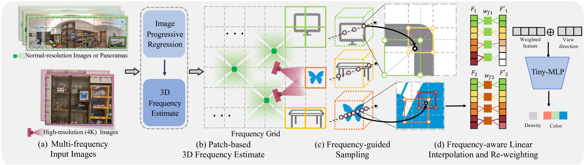
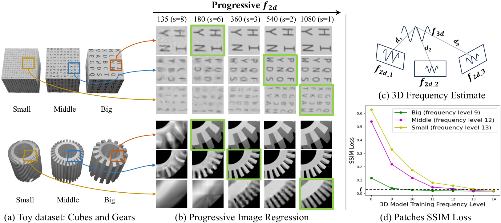
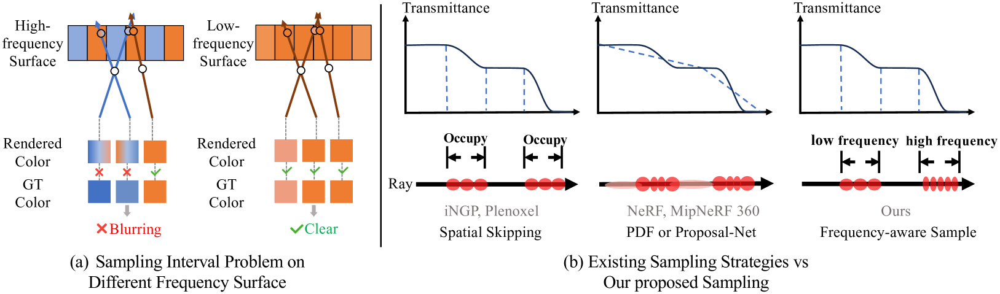
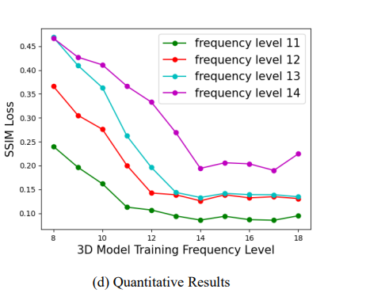

# 1 Introduction

We propose FA-NeRF, a frequency-aware framework for high-fidelity novel view synthesis across broad scene structures and close-up details. FA-NeRF introduces a patch-based 3D frequency quantification method to analyze and embed scene frequency distributions into NeRF’s encoded features, allowing adaptive frequency selection for accurate reconstruction.

Efficiently synthesizing high-quality views with detailed structure remains challenging even with frequency quantification. First, we design a Frequency Grid that stores spatial frequency distributions, enabling rapid convergence and efficient querying. Second, we propose a frequency-aware feature re-weighting strategy to tailor feature frequencies based on scene content, optimizing network capacity. Third, a frequency-averaged sampling strategy adaptively adjusts learning intensity and sampling density for high-frequency content. With the Hash Grid architecture, we maintain a rendering speed of 20 FPS on a single RTX 4090 GPU, even when rendering high-frequency details. In summary, our contributions lie in three aspects:

*   The proposed FA-NeRF framework features both the scene’s overall structure and tiny details within a single model, achieving an immersive roaming experience in rendering with large frequency spans.
*   A novel patch-based 3D frequency quantification method using image progressive regression and conducting several novel techniques: a frequency grid for fast frequency convergence and query, feature re-weighting, and sampling adjustment to enhance the model’s sensitivity to various frequency content.
*   FA-NeRF significantly outperforms the baselines across our Multi-frequency dataset and generalizes well on 2 standard datasets.

**Figure 2: Overview.** (a) Our input dataset consists of dense normal-resolution images or panoramas of the entire scene structure and high-resolution images focusing on the area of interest of the scene. (b) We propose to quantify the 3D frequency of the scene by progressive image regression and maintain a frequency grid to divide the scene into subspaces with different frequency distributions. (c) We employ a frequency-guided sampling to adaptively control the density of sampling according to the frequency of different objects. (d) Then, the grid-encoded feature of each sample point is re-weighted by the frequency-related weight function. The density and color are decoded by a tiny multilayer perceptron which takes the re-weighed feature and view direction as input.

# 3 Preliminaries

Neural Radiance Field (NeRF) parameterizes the scene as a continuous implicit function $F$, mapping a 3D position $\mathbf{x} \in \mathbb{R}^{3}$ and a viewing direction $\mathbf{d} \in \mathbb{S}^{2}$ to a color vector $\mathbf{c} \in [0,1]^{3}$ and a volumetric density $\sigma \in \mathbb{R}^{+}$. Each pixel on the image determines a ray emitted from the camera center of projection to the pixel. Instead of sending position $\mathbf{x}$ and direction $\mathbf{d}$ to the network, a positional encoding function is used to map them into a higher dimensional space.
This can be formulated as
$$(\mathbf{c}, \sigma) = F_{\theta}(\gamma_{x}(\mathbf{x}), \gamma_{d}(\mathbf{d})), \text{ (1)}$$
where $F$ denotes an MLP with parameters $\theta$, and $\gamma: \mathbb{R}^{3} \to \mathbb{R}^{3(1+2L)}$ a positional encoding function with $L$ frequency channels. The network is then optimized following the volume rendering procedure to represent scenes with photo-realistic rendering.

**Frequency components in positional encoding.** There are mainly two types of positional encoding. Vanilla NeRF uses Fourier-transformed features to encode the position, and higher Fourier series terms correspond to higher frequency components. NeRF [29] uses a simple concatenation of sines and cosines as a positional encoding function, which is applied to each dimension of the normalized 3D position $\mathbf{x}$ separately:
$$\gamma(\mathbf{x}) = (\sin(2^{0}\pi\mathbf{x}), \cos(2^{0}\pi\mathbf{x}), \dots, \sin(2^{L-1}\pi\mathbf{x}), \cos(2^{L-1}\pi\mathbf{x})). \text{ (2)}$$
$L$ determines the highest sampling rate, hence having a critical impact on the fidelity of NeRF.

To remedy the aliasing issue caused by multiscale training data, Mip-NeRF [1] considers a ray as a cone and divides it into several conical frustums whose mean and variance $(\mu, \Sigma)$ are used for integrated position encoding (IPE):
$$\gamma(\mu, \Sigma) = \left\{ \begin{bmatrix} \operatorname{sin}(2^{l}\mu)\exp(-2^{2l-1}\operatorname{diag}(\Sigma)) \\ \operatorname{cos}(2^{l}\mu)\exp(-2^{2l-1}\operatorname{diag}(\Sigma)) \end{bmatrix} \right\}_{0}^{L-1}. \text{ (3)}$$

In grid-based NeRF, parametric encoding is common. Instant-NGP (iNGP) [31] introduces multi-resolution hash encoding, replacing positional encoding with a pyramid grid that spans coarse to fine resolutions. Each of the $L$ resolution levels in the hash table stores $F$-dimensional feature vectors at grid corners, and each 3D position $\mathbf{x}$ retrieves a feature vector by interpolating and concatenating features from surrounding corners across levels. The $L$ levels in hash encoding are analogous to frequency channels in frequency encoding: higher resolution levels capture high-frequency components, while lower resolution levels capture low-frequency components.

**Figure 3:** We show 3D frequency quantification on toy examples. (a) The toy datasets comprise three kinds of frequency variations in geometry or texture: three cubes with the appearance of different font sizes, and three gears with the geometry of different pitches. (b) The rendered high-frequency details under different frequencies. ”135($s$=8)” means the frequency is 135 and the grid stride $s$ is 8 [31]. The green squares denote the minimal frequency (selected) of the patch for clear reconstruction. (c) The 3D frequency comes from a set of projected 2D frequencies with focal length and depth. (d) The SSIM loss (vertical axis) of training results when using different frequencies (horizontal axis) in three kinds of patches.

# 4 Method

We introduce FA-NeRF, a frequency-aware neural radiance field for high-fidelity novel view synthesis with multi-frequency details (see Fig. 2). Our input images include panoramic shots from a standard camera and high-resolution (up to 4K) images from an SLR camera, with camera poses recovered via structure from motion (SfM). In Sec. 4.1, we estimate the scene's 3D frequency distribution using a patch-based quantification method. Then, in 4.2, we apply a frequency-aware training framework to preserve these details, utilizing a frequency grid and re-weighting features based on the estimated frequency information.

## 4.1 Evaluate Frequency Level from 2D to 3D

Inspired by multi-plane image features for novel view synthesis [47], we propose a hypothesis: In the NeRF framework, the geometric or appearance frequency of 3D content can be inferred from the frequency in its degraded 2D image space.
To provide a more intuitive description of this process,
we created a toy dataset shown in Fig. 3 (a), containing three cubes with the appearance of different-sized letters and three gears with the geometry of different-sized tooth pitches. These two scenes correspond to three different texture frequencies and geometric frequencies respectively.

**Progressive image regression.**
Our key idea is to progressively add higher-frequency encoded feature components of NeRF until the image patch recovers clear structural information.
We define this frequency as the 2D frequency of this patch.
For a NeRF network in Eq. (1), we use a coordinate-based MLP network to perform image regression: $F_{\theta}(\mathbf{x})=\mathbf{c}$, where $\mathbf{x}$ is the 2D coordinate of a sampled pixel and $\mathbf{c}$ is the color.
Given a 3D point $p$ and its corresponding patch $P$, set $\left\{\hat{P}_{f_{1}},\hat{P}_{f_{2}},...,\hat{P}_{f_{n}}\right\}$ represents the rendering results at 2D frequency $f_{i}$ where $i$ indexes the frequency components and ranges from $1$ to $n$. The target 2D frequency $f_{2D}$ is defined as the minimum frequency $f$ that satisfies $SSIM(P,\hat{P}_{f})>t$. SSIM denotes Structural Similarity Index Measure to determine whether the patch fitting meets the required standards, $f$ lies in $\left\{f_{1},f_{2},...,f_{n}\right\}$, and $t$ is a predefined threshold.
As depicted in Fig. 3(b), with frequency $f$ increasing from 135 to 1080, the rendering quality gradually improves. The green box indicates the first patch that satisfies the SSIM loss threshold, and the corresponding frequency is the 2D frequency of the 2D image.

**3D frequency estimation.**
For point $p$ and patch $P$ mentioned above, we project the 2D frequency $f_{2D}$ to 3D space with the focal length $fl$ and the depth $d$ of the point to get its 3D frequency
$$f_{3D}(fl,d)=f_{2D}\cdot\frac{fl}{d}. \tag{4}$$
Since point $p$ has multiple visual patches, its 3D frequency set can be defined as $F=\left\{f_{3D_{j}}|j=1...,m\right\}$ calculated with patches $\left\{P_{j}\right\}$ and the 3D frequency of point $p$ is defined as the median of set $F$, as illustrated in Fig. 3 (c).

We only perform projection in regions having 2D-3D correspondence because consistency observation is the key to generating coherent 3D content. During the training process, we update the depth with:
$$d(\mathbf{r})=\int_{t_{n}}^{t_{f}}T(t)\cdot\sigma(\mathbf{r}(t))\cdot t\cdot dt, \tag{5}$$
where $t_{n}$ and $t_{f}$ denote the nearest and the farthest distance from the camera center along the ray respectively, and $T(t)$ denotes the accumulated transmittance from $t_{n}$ to $t$. In Fig. 3 (c), we show the frequency projection process from 2D to 3D space.

Moreover, as depicted in Fig. 3(d), green, magenta, and yellow lines represent patches with 3D frequency levels of 9, 12, and 13, respectively. As the training frequency level increases from 8 to 14, the SSIM loss of rendered patches gradually decreases. When the training frequency reaches the corresponding 3D frequency of each patch, the SSIM loss drops below the threshold. This indicates that: 1) The minimum NeRF frequency level required to fully restore the structures and the textures of different 3D frequencies in the scene varies; 2) Our 3D frequency estimation for the 3D contents accurately reflects their true frequencies.

This conclusion is helpful for understanding rendering performance in multi-frequency scenes.

**Figure 4:** (a) We illustrate the sampling interval problem on different frequency surfaces. While using larger sampling intervals still achieves correct results on the low-frequency surface, it leads to misleading results on the high-frequency surface, resulting in excessive smoothing (b) We compare three sampling strategies along the ray. Our strategy adjusts the sampling interval to match the content's frequency.

## 4.2 Frequency-aware Framework

Directly training on multi-level frequency data may lead to incorrect geometry and make convergence difficult [49, 9]. "Coarse-to-fine" is a widely adopted learning strategy [37, 12, 44], which first reconstructs the scene structure using low-frequency feature components and then promotes detail recovery using high-frequency feature components. However, in complex multi-frequency data, these strategies cannot accurately restore details without knowing the frequency hierarchy of the target objects.
Moreover, as shown in Fig. 4 (a), the sampling strategy affects the rendering results in different frequency surfaces.
Therefore, we propose a frequency grid to store the frequency distribution of the scene and adjust the NeRF-encoded features at different frequency levels through re-weighting to make more efficient use of NeRF-encoded feature space for various frequency content and adjust the sampling strategy to enhance learning high-frequency content.

**Frequency grid.** We use a frequency voxel grid $\boldsymbol{V}^{(\text{frequency})}\in\mathbb{R}^{N_{x}\times N_{y}\times N_{z}\times 1}$ to store spatial occupancy information and records the frequency information of the content occupying the space, as illustrated in Fig. 2(b). $\boldsymbol{V}^{(\text{frequency})}$ is initialized by the point cloud.
Given a 3D point $p$ in the point cloud and its observation images, we re-project it to these images and set $\left\{P_{i}|i=1,...,n\right\}$ denotes $n$ corresponding patches where the re-projected point locates. $n$ equals the number of observation images of point $p$.
As mentioned in Section 4.1, each point $p$ has its 3D frequency $f_{{3D}}$.
Thus the $\boldsymbol{V}^{(\text{frequency})}$ is initialized with $f_{grid}=\max\left\{f_{{3D}_{j}}|j=1,...,m\right\}$ where $m$ denotes the amount of 3D points in this grid.
The values stored in the $\boldsymbol{V}^{(\text{frequency})}$ are normalized according to the scale of the scene to ensure consistency with the encoded feature frequency components of NeRF.

As we gradually reconstruct the scene structure and get the depth of the training ray, the frequency value is updated using Eq. (4). Since all the 2D frequencies $f_{2D}$ have been obtained, this process consumes only a negligible amount of computational resources.

**Frequency re-weighting.** To achieve a better balance of features across varying frequencies, we re-weight the feature at each frequency level based on the quantified frequency in $\boldsymbol{V}^{(\text{frequency})}$. Although high-frequency feature components contribute little to low-frequency content, directly decomposing features to separately learn multi-frequency content is not effective [49]. Therefore, by applying smooth re-weighting, we adjust the sensitivity of each frequency component in the NeRF-encoded features, thereby preventing wasting the expressive capacity of high-frequency feature components on low-frequency content.
In Instant-NGP [31], the sampled point, whose spatial location is $\mathbf{x}$, will be first scaled by the grid linear size $n_{\ell}$ at the frequency (*i.e.* level) $\ell$.
The feature of the sampled point at the frequency $\ell$ comes from tri-linear interpolation within hash grid $V_{\ell}$.
These vectors are directly concatenated to form the encoded feature $\mathbf{f}$.
However, we do not directly concatenate these vectors; instead, we apply a frequency-related down-weighting factor:
$$\omega_{\ell}=\text{erf}\!\left(\sqrt{\frac{(\ell_{\text{max}}-\ell_{\text{min}})^{2}}{\text{Clip}[(\ell_{\text{max}}-\ell+1)^{2},\{1,(\ell_{\text{max}}-\ell_{\text{min}})^{2}\}]}}\right), \tag{6}$$
where $\ell_{\text{min}}$ and $\ell_{\text{max}}$ are the minimum and maximum frequency in $\boldsymbol{V}^{(\text{frequency})}$ respectively, and $\omega_{\ell}\in[0,1]$, before that:
$$\mathbf{f}=\underset{\ell=0..k}{\text{concat}}(\omega_{\ell}\cdot\text{trilerp}(n_{\ell}\cdot\mathbf{x};V_{\ell})), \tag{7}$$
where $k$ is the number of levels in the hash grid $V$.
Since low-frequency feature components are used in learning high-frequency content, we opt for a one-sided weight reduction function.

**Frequency-averaged sampling.**
Since the complexity of geometry or texture in the high-frequency area is more than that of the low-frequency area, the high-frequency area deserves more extensive learning. However, random pixel sampling within the dataset uses a uniform probability for low-frequency and high-frequency areas in a training batch. Therefore, we propose a frequency-averaged sampling (FAS) strategy. Assume there are N effective frequencies in the scene and each frequency contains a patch set of size n(n > 0). We evenly divide a training batch into N segments . Each segment samples pixels within a corresponding frequency patch, thereby increasing the sampling probability of high-frequency areas. To achieve a high-quality novel view synthesis, we don’t sample the entire patch; instead, we adjust the probability of pixels being sampled on a patch-by-patch basis. We progressively employ this sampling strategy to encourage the network to form the correct geometry first. For more details, please refer to the supplementary material.

**Adaptive Ray Marching.** 

The sampling interval in ray marching affects the quality of high-frequency details, especially when reconstructing high-frequency details at the scale of the entire scene. Recall that NeRF models a 3D scene using a rendering function as Eq. 1, which maps the coordinates of a 3D point to the properties of the scene.

The ray sampling interval refers to the distance between adjacent sample points along a ray. As shown in Fig. 4(a), with a large sampling interval, the low-frequency surfaces can recover their original colors, while high-frequency areas are prone to rendering incorrect colors due to the sampling points too far from the surface, resulting in blurred outcomes. When the sampling interval is reduced, the sampling points in the high-frequency areas are closer to the surface, thus generating more accurate results.

Therefore, many studies adjust the sampling interval by manually tuning the sampling steps or setting different proposal steps for different scenes to achieve optimal performance. We adjust the sampling interval based on the quantified frequency grid to accommodate the sampling needs of high-frequency areas. The common sampling methods are compared in Fig. 4(b). Spatial skipping based on the occupancy grid is the degraded form of our sampling method. Given the frequency value $f$ of the frequency grid traversed by ray $l$, the sampling frequency $f_{\text{sample}}$ should be ensured to be less than twice the detail frequency to comply with the sampling theorem, i.e. the sampling frequency is

$$f_{\text{sample}} = 2f.$$

Based on this formula, we can estimate an appropriate sampling interval according to the frequency of the content, eliminating the need to tune the sampling hyperparameters for different scenes.

## Training Loss

The training loss is defined as

$$\mathcal{L}_{\text{total}} = \mathcal{L}_{\text{recon}}(\hat{\mathbf{c}}, \mathbf{c}_{gt}) + \lambda_{\text{dist}} \mathcal{L}_{\text{dist}}(\mathbf{s}, \mathbf{w}) + \lambda_{\text{depth}} \mathcal{L}_{\text{depth}}.$$

where

$$\mathcal{L}_{\text{recon}}(\hat{\mathbf{c}}, \mathbf{c}_{gt}) = \sqrt{(\hat{\mathbf{c}} - \mathbf{c}_{gt})^2 + \epsilon}$$

is a color reconstruction loss, $\hat{\mathbf{c}}$ is the rendered pixel color, $\mathbf{c}_{gt}$ is the ground-truth pixel color, and $\epsilon = 10^{-4}$.

We regularize the density distribution in disparity through $\mathcal{L}_{\text{dist}}$, which is proposed by Mip-NeRF360, where $\mathbf{s}$ is the set of normalized ray distances and $\mathbf{w}$ is the set of weights. It penalizes the discreteness to encourage the formation of thinner surfaces. In contrast to Mip-NeRF360 using a proposal network to obtain sampling suggestions, we compute this discrete version of sampling distribution regularization along the entire ray.

$\mathcal{L}_{\text{depth}}$ is the depth loss between the estimated depth and the actual value from the sparse point cloud, which is used in early training to avoid incorrect geometry formation.

$\lambda_{\text{dist}}$ and $\lambda_{\text{depth}}$ are the coefficients of loss. We provide more training details in the supplementary material.

# 7 Additional Implementation Details

## 7.2 Architecture details

We adopt a setup similar to Instant-NGP [31], utilizing 16 grid scales with the maximum resolution being 2048×scene size and the minimum resolution being 16, employing 2 feature channels per level. In our dataset, due to the larger scene sizes, we set the size of the hash table storing feature vector for each level to $2^{23}$ to mitigate the impact of hash collisions on scene representation. For other general scenes, we use an identical hash table size of $2^{19}$ to Instant-NGP [31]. The fetched hash feature vectors are down-weighted before being concatenated and fed to a one-layer MLP with 64 hidden units to get the scene features and the volume densities. Subsequently, the scene features are concatenated with the spherical harmonics encoding of the view directions, which is then input to a subsequent two-layer MLP of width 64 to yield the RGB colors.

## 7.3 Frequency Grid

To represent the frequency distribution in the 3D space, we maintain a frequency grid with a resolution of 128×AABB, where AABB, short for Axis-Aligned Bounding Box, denotes the scene size. For each scene, we adjust the AABB based on the 3D points from the SfM reconstruction to ensure it encompasses the majority of the 3D points. Each grid cell stores the frequency level as a uint8 number.

**Initialization.** Once we have the 2D frequencies of all training patches, we first calculate the 3D frequency of each 3D point $p_{i}$. After that, each 3D point is reprojected to obtain a set of observation patches $\{P_{ij}|j=1,...,n\}$ and derive a set of 3D frequencies $\{f_{{3D}_{ij}}|j=1,...,n\}$ with the depth of the point. To mitigate the influence of noisy patches, we take the median of this set as the 3D frequency $f_{{3D}_{i}}$ for that point. Assuming that the frequencies at each level are $\{f_{{3D}_{\ell}}|\ell=0,...,n_{\ell}\}$, we take the frequency level $\ell_{i}$ as $\underset{\ell}{\arg\min}(|f_{{3D}_{\ell}}-f_{{3D}_{i}}|)$. The frequency grid is then initialized to the maximum of the frequency levels of all 3D points within the grid.

**Re-weighting.** Unlike Instant-NGP [31], which directly concatenates feature vectors as the input for the tiny MLP, we take into account the 3D frequency at that point and re-weight different frequency components accordingly. Instead, we use the quantified frequency level $\ell$ as a threshold and apply a down-weighting to frequency components that are higher than $\ell$.
We compute the down-weighting factor $w$ using an approximation for $\text{erf}(x)$:
$$\text{erf}(x)\approx\text{sign}(x)\sqrt{1-\text{exp}(-(4/\pi)x^{2})} \tag{10}$$

**Updating.** We update the grids after every 1024 training iterations by the following steps. We first render the depth of the center pixel of a training patch $P_{i}$. Then, the 2D frequency of the patch is projected to the corresponding 3D point to obtain its 3D frequency $f_{{3D}_{i}}$ and frequency level $\ell_{i}$. Finally, the value $\ell$ of the frequency grid where the 3D point resides is then updated to $\max(\ell_{i},\ell)$.

**Frequency-averaged sampling(FAS).** We divides the training batch into $N$ segments based on the frequency quantization results. The sampling frequency is evenly distributed within a preset range of [1, 3], meaning that the highest frequency content is sampled with a probability three times that of the lowest frequency. In our experiments, we found that this is a more stable setting compared to directly using the frequency ratio as the sampling proportion.

## 7.4 Loss Functions

As described in the main paper, the training loss is defined as
$$\mathcal{L}_{total}=\mathcal{L}_{recon}(\hat{\mathbf{c}},\mathbf{c}_{gt})+\lambda_{depth}\mathcal{L}_{depth}(\hat{\mathbf{d}},\mathbf{d}_{gt})+\lambda_{dist}\mathcal{L}_{dist}(\mathbf{s_{d}},\mathbf{w}), \tag{11}$$
where the first term $\mathcal{L}_{recon}(\hat{\mathbf{c}},\mathbf{c}_{gt})=\sqrt{(\hat{\mathbf{c}}-\mathbf{c}_{gt})^{2}+\epsilon}$ is a color reconstruction loss [2], $\hat{\mathbf{c}}$ is the rendered pixel color, $\mathbf{c}_{gt}$ is the ground-truth pixel color, and $\epsilon=10^{-4}$, and the last term is the regularization loss.

The depth loss $\mathcal{L}_{depth}$ of the sampled ray is defined by
$$\mathcal{L}_{depth}(\hat{\mathbf{d}},\mathbf{d}_{gt})=\sqrt{(\hat{\mathbf{d}}-\mathbf{d}_{gt})^{2}+\epsilon} \tag{12}$$
where the depth of a ray is computed by the weighted sum of the sampled distance that $d=\sum_{i}w_{i}t_{i}$, and $\{w_{i}\}$ are the weights computed by the volume rendering. We only use the depth loss in early training for pixels with GT depth from the sparse point cloud to avoid incorrect geometry structure.

The regularization loss is proposed by Mip-NeRF360 [2]. We use it to prevent floaters and background collapse, which is defined as
$$\mathcal{L}_{\text{dist}}(\mathbf{s_{d}},\mathbf{w})=\sum_{i,j}w_{i}w_{j}\left|\frac{s_{i}+s_{i+1}}{2}\frac{s_{j}+s_{j+1}}{2}\right|+\frac{1}{3}\sum_{i}w_{i}^{2}(s_{i+1}-s_{i}), \tag{13}$$
where $\mathbf{s_{d}}$ is the set of normalized ray distances and $\mathbf{w}$ is the set of weights. It penalizes the discreteness to encourage the formation of thinner surfaces. In contrast to Mip-NeRF360 using a proposal network to obtain sampling suggestions, we compute this discrete version of sampling distribution regularization along the entire ray.

The hyperparameters $\lambda_{dist}$, $\lambda_{depth}$ are used to balance the data terms and the regularize; we set $\lambda_{dist}=0.01,\lambda_{depth}=0.001$ for all experiments.

# 8 Evaluate Frequency Level from 2D to 3D

In this section, we further demonstrate the effectiveness of frequency quantification from 2D to 3D using the real dataset Mip-NeRF360-v2.

**Visualization of Frequency Distribution.** As described in the main paper, we reproject each 3D point from the sparse point cloud back into all the observation images. Then we calculate the 3D frequency set $S$ based on all the corresponding patches. The median of $S$ is taken as the 3D frequency for that point. Fig. 7(b) shows a visualization of the 3D frequency distribution of all 3D points after initialization for the dataset *counter* in Mip-NeRF360-v2, where the color of the points indicates the corresponding 3D frequency, with points closer to blue indicating a lower frequency and those closer to red indicating a higher frequency. Fig. 7(a) represents the ground truth image, where the blue, green, and red boxes represent three patches with 3D frequencies from low to high as shown in Fig. 7(b).

**Qualitative Results.** Fig. 7(c) depicts the visual comparison of the rendering results under varying training frequencies of the three patches mentioned above, where the boxed patches represent the rendering results under the quantified 3D frequency level $\ell_{3D}$. It is clearly demonstrated that when the training frequency level is lower than $\ell_{3D}$, the network is unable to fully recover the detailed information. Conversely, when the training frequency exceeds the quantified 3D frequency, the network does not yield better results either.

**Quantitative Results.** Furthermore, in Fig. 7(d), the lines in green, red, blue, and purple correspond to patches with 3D frequency levels of 11, 12, 13, and 14, respectively. With the escalation of the training frequency from 8 to 14, there is a progressive reduction in the SSIM loss for the generated patches. Upon reaching the quantified 3D frequency for each patch with the training frequency, the SSIM loss reduction becomes more consistent. This observation suggests two key points: firstly, the necessary minimum NeRF frequency level for the complete reconstruction of the scene's diverse 3D frequency structures and textures is variable; secondly, the 3D frequency estimation we employ for the content provides an accurate reflection of their actual frequencies.

### Baselines and Implementation

We set a constant batch size of $2^{18}$ for point samples. Ray batch sizes vary based on the average number of sampled points per ray. We employ the Adam optimizer for parameter training with $\beta_1 = 0.9$, $\beta_2 = 0.99$, $\epsilon = 10^{-15}$. We train all methods for 200k steps to achieve full convergence.

