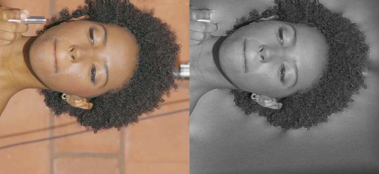
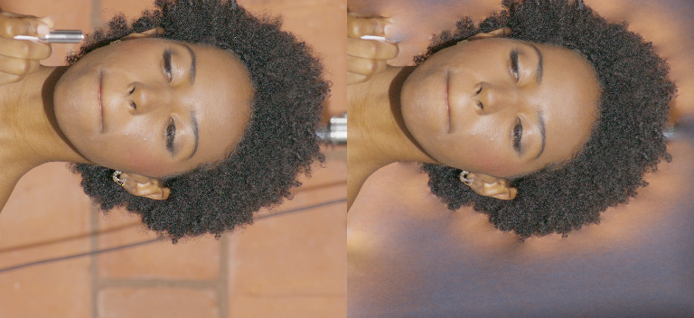
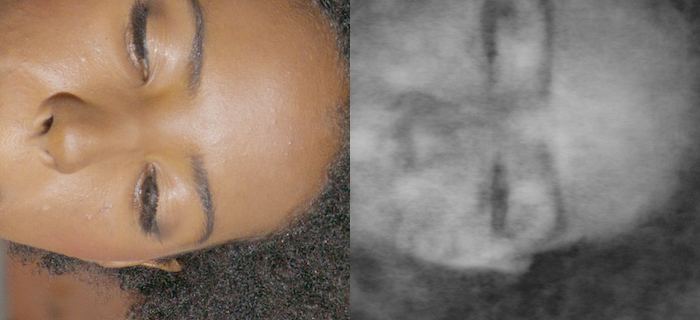
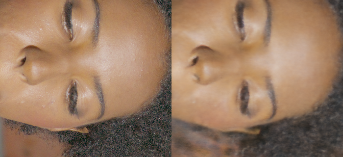
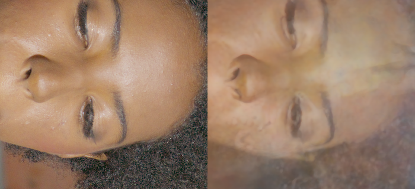

# Fresh single-seed LookCloser blur ablations

## What was tested

2026-09-29. In progress; no quality change promoted. Base `630d58bd`, candidate
archive `8389770b`, one seed (42), independently initialized experiments. Maximum
campaign budget: 24 GPU-hours. Main was not changed.

Budget accounting merges overlapping active intervals on the one shared GPU,
including setup and evaluation. The sum of concurrent job wall times is also
logged as a conservative upper bound; it is not labeled actual GPU time.

The density bundle is split into activation, inverse-AABB scale, precision and
clipping. SH remains an independent control. The diagnostic runner uses the
standard LookCloser pipeline and `Trainer.train_iteration`, including its normal
AMP/Adam/scheduler and callbacks. Evaluation preserves Python/NumPy/Torch RNG.
Initial field parameter digests and the first 32 sampled batches match across
the six initial density controls.

Synthetic diagnostic: one teacher train camera, two teacher validation cameras,
3000 updates, 2048 rays, fixed128, hash19, LR .01→.001, corrected SH. Valid-pixel
uniform sampling is shared by all controls; this differs from the historical
distillation loop and uses no teacher depth. Existing fitted frequency maps are
shared. Historical numbers are not used as a paired baseline.

Real benchmark: fixed calibrated RGB for DEC5 `000973`, 62 train / **3** eval,
1920×1080; the two additional held-out cameras use identity color profiles and
the same frozen exposure. This campaign fits no profile or geometry from eval
RGB and fits frequency maps on train RGB only. Historical camera calibration
and mesh-derived masks are reused; their provenance does not establish an
untouched holdout. This is a paired regression benchmark.
The real room remains in training and full-frame evaluation. Native GT-only
detail rectangles are fixed before real training. Full-image frequency maps are
fitted on train images only, 1000 updates/level as in the local paper.

Fight control: `007740`, 66 train / 3 eval, inherited Stage-A model/optimizer
settings and 30376 updates. All quality claims must use fresh paired results.

Runtime: `/home/brans/repos/nerfstudio/.venv`, Torch 2.7.1+cu128, RTX PRO 6000.
The requested Ubuntu Conda is inaccessible. Large artifacts live under
`/home/brans/lookcloser_artifacts/blur_ablation_fresh`; source, requests and compact
evidence live in this repository. [Cleanup log](assets/blur_ablation_fresh/cleanup.jsonl)
records 96.45 GiB of intermediate, unlinked checkpoints owned by `brans`, with
run requests and retained best models. Other users' checkpoints were untouched.

## Results

The synthetic controls reproduce the gray training-view failure. Independent
FP32 and exponential activation controls do not remove it. Inverse-AABB scaling
of **softplus alone** restores color and detail. See the
[common-protocol metrics](assets/blur_ablation_fresh/single_metrics.json).
These are quantized stride-2 diagnostic renders, not native full-scene scores.

| Single-view control, step2000 | Train PSNR ↑ | SSIM ↑ | LPIPS ↓ |
| --- | ---: | ---: | ---: |
| Softplus | 20.233 | .93720 | .22891 |
| Only FP32 density | 20.233 | .93722 | .22885 |
| Exponential + FP32, unscaled | 20.244 | .94077 | .22669 |
| Only inverse-AABB scale, FP16 softplus | **39.721** | **.98948** | **.00500** |
| Scaled softplus + FP32 | 39.668 | .98959 | .00503 |
| Scaled exponential + FP32 | 39.999 | .98942 | .00443 |
| Add exponential clipping | 40.035 | .98944 | .00438 |
| Scaled softplus, legacy SH | 39.360 | .98868 | .00534 |
| Unscaled softplus, AMP scale65536 | 20.233 | .93735 | .22871 |
| Unscaled softplus, no distortion | 20.234 | .93748 | .22837 |

Each panel is GT left / learned RGB right. Unknown teacher background is not
supervised or counted in this table; its arbitrary prediction remains visible.

The [saved-field audit](assets/blur_ablation_fresh/saturation.json) evaluates
1024 fixed valid training rays. Both unscaled softplus and unscaled exponential
have opacity-normalized RGB exactly `[1,1,1]` on all sampled rays at the selected
step1000 checkpoint. They encode a grayscale image through opacity. With scaled
softplus the white-saturation fraction is zero and chroma is nonzero.

Eight numerical/GPU tests pass: legacy softplus identity; FP32 exponentiation
outside autocast; scaling of optical thickness and gradients; clipping;
independent SH addition-theorem reference; and agreement between field-query
and density/occupancy-query paths. The additional check covers FP16 overflow of scaled softplus in tiny world units. Scene-quality acceptance remains pending.

## Insights and next steps

The early synthetic failure is an RGB saturation failure, not evidence that
exponential density is necessary. A density gain prevents this failure in the
small actor AABB. Increased AMP scale and removal of distortion do not fix the
same control. Transfer to real full-scene training is still unverified.

The final selector uses mean full-frame eval PSNR across all held-out cameras,
with LPIPS breaking ties within .07 dB. Matched-step comparisons remain separate.
The primary detail score is the equal-weight mean over face/hair/lipstick
rectangles across the three eval cameras (nine rectangles); the three train
cameras are diagnostic. Acceptance requires ≥.5 dB detail improvement with supporting SSIM/LPIPS and
visible train/eval improvement; fight tolerance is .10 dB PSNR / .005 SSIM /
.01 LPIPS with no new visible defect. No between-seed robustness is claimed.

### Initial real-scene checks

The original full-scene model reproduces blurred train and eval views at 2000
and 4000 updates; facial structure starts to appear after switching from the
256-sample warmup to adaptive marching. The 6000-step frozen-weight
[rendering audit](assets/blur_ablation_fresh/frozen_rendering.json) changes only
integration, with stride-2 face patches. Corrected allocation changes train
PSNR by +.016 dB and eval PSNR by -.014 dB. Uniform4096 does not restore detail.
This rules out a render-only correction as the main fix at this checkpoint.

The [real early color audit](assets/blur_ablation_fresh/real_saturation_early.json)
finds no saturated RGB channel among the sampled rays, unlike the synthetic
control. These are distinct failure conditions. The synthetic density result
must not be presented as an already proven explanation of the real failure.

The calibrated input cameras and color profiles predate this experiment; some
held-out views were examined during earlier development. This is a paired
regression benchmark, not an untouched generalization benchmark.

### Fresh fight baseline

| Updates | Eval PSNR ↑ | SSIM ↑ | LPIPS ↓ |
| --- | ---: | ---: | ---: |
| 15188 | 28.7756 | .65091 | .36464 |
| **30376, selected** | **29.4741** | **.67341** | **.29662** |

Native all-three-view [metrics](assets/blur_ablation_fresh/fight_baseline_metrics.json),
[input hashes](assets/blur_ablation_fresh/fight_input_hashes.json) and
[initialization receipt](assets/blur_ablation_fresh/fight_baseline_identity.json).
Visual review of full frames and fingers shows no lipstick-like collapse.
This is the fresh regression control, not the longer historical Stage-A→FR.3 leader.

### Real density-scale control, 8000 updates

Identical initialization and first 32 pixel batches. All numbers are native
float RGB; [full receipts](assets/blur_ablation_fresh/real_density_screen_initial.json).

| Control | Full eval PSNR / SSIM / LPIPS | Eval detail PSNR / SSIM / LPIPS | Train detail PSNR / SSIM / LPIPS |
| --- | --- | --- | --- |
| Original | 14.797 / .73208 / .77829 | 17.499 / .67597 / .66204 | 27.635 / .68848 / .56359 |
| Only inverse-AABB density | 15.923 / .74405 / .72526 | 17.618 / .67278 / .66897 | 26.973 / .67203 / .59745 |

Scaling does **not** pass the real-detail gate: +.119 dB with worse SSIM/LPIPS,
and worse train detail. It helps full-frame appearance at this step but does
not remove facial blur. Full-frame selection chooses original step2000
(16.690 / .74761 / .73014), versus scaled step8000
(15.923 / .74405 / .72526). The early synthetic win is specific to the small
actor box and its saturation failure; it is not a validated global real-scene fix.

### Real pixels in the small actor box

Two additional fresh seed42 probes replace synthetic RGB with the actual
`train_0033` photo, keeping the same actor bounds, known-pixel mask, fixed128,
2048 rays, LR and SH. They use a duplicate of the same camera for diagnostic
evaluation: **there is no held-out-view claim**. The mesh supplies only a
validity mask for train sampling, not RGB or depth supervision.

| Real single train view, step2000 | PSNR ↑ | SSIM ↑ | LPIPS ↓ |
| --- | ---: | ---: | ---: |
| Original softplus | 20.2251 | .93685 | .23067 |
| Only inverse-AABB scaling | **40.9725** | **.99043** | **.00336** |

[Quantized stride2 masked train metrics](assets/blur_ablation_fresh/real_single_metrics.json).
The color-collapse mechanism transfers to real pixels in the small box.
Unknown/untrained background is excluded from these scores.

### Other initial full-scene controls

| Isolated control, 8000 updates | Full eval PSNR / SSIM / LPIPS | Eval detail PSNR / SSIM / LPIPS | Train detail PSNR / SSIM / LPIPS |
| --- | --- | --- | --- |
| Correct SH only | 14.941 / .71695 / .82522 | 15.835 / .62070 / .79339 | 27.046 / .67157 / .62443 |
| Tighter full-scene bounds only | 21.311 / .77495 / .52494 | 21.729 / .68824 / .53915 | 25.945 / .65297 / .56149 |

SH alone does not fix blur and worsens matched-step detail. Its contract test
is not evidence of an image-quality gain. [Receipts](assets/blur_ablation_fresh/real_sh_screen.json).
Tighter bounds improve eval detail by +4.230 dB, but train detail PSNR/SSIM
decline and the face remains visibly soft. This is a useful geometric-volume
control, not yet a complete blur fix. [Receipts](assets/blur_ablation_fresh/real_bounds_screen.json).

A [frozen-field depth audit](assets/blur_ablation_fresh/real_baseline_surface_density.json)
on train33 uses an approximate historical mesh reference. Original step8000
has median expected ray depth .607 versus reference .813, while a local
density peak remains near the reference surface. This suggests substantial
opacity in front of the face; the imperfect mesh is not declared ground truth.

The [dense-warmup frozen renderer audit](assets/blur_ablation_fresh/dense_warmup_rendering_audit.json)
uses step4000, trained with fixed1024. Corrected ARM allocation raises one train
face from 24.023 to 26.003 dB but lowers the eval face from 19.048 to 18.206 dB;
fixed4096 also fails to recover sharp held-out detail. No renderer-only fix is
promoted from these mixed results.

The long original run reaches 14.843 dB at step8000, versus 14.797 for the
short screening run with the same seed. The same-seed runs are not bitwise identical; their eval schedules and GPU
concurrency differ. Evaluation restores RNG, and initialization and first
sampled batches match. This is not a between-seed uncertainty estimate. Differences of
hundredths of a dB are not treated as meaningful, and no cross-seed robustness
is claimed.

Pending controls also separate learning-rate choices from field changes:
initial LR .001 versus .01, and decay horizon8000 versus200000. Additional
exp+SH and exp+SH+bounds controls are prepared to test interactions before
rejecting a component solely on its standalone result. Each request records
one changed training condition against its named parent.

### Precision and denser warmup, 8000 updates

| Control | Full eval PSNR / SSIM / LPIPS | Eval detail PSNR / SSIM / LPIPS | Train detail PSNR / SSIM / LPIPS |
| --- | --- | --- | --- |
| FP32 softplus only | 14.772 / .73140 / .78440 | 17.438 / .67387 / .67195 | 27.623 / .68770 / .56757 |
| Warmup256→1024 only | 15.305 / .74418 / .72981 | 17.865 / .68701 / .62592 | 27.766 / .69299 / .56084 |

[Receipts](assets/blur_ablation_fresh/real_precision_warmup_screen.json).
FP32 changes detail by -.060 dB and does not remove blur. Denser warmup gains
+.366 dB detail and improves LPIPS, but falls below the registered .5 dB gate
and still leaves severe blur. These are not accepted as the main quality fix.
The original 16000-step run remains blurred (full eval14.494 dB; detail17.394 dB),
so doubling training from8000 has not resolved held-out-view failure.

### Historical foreground task versus the full room

The archived [real-only request](assets/blur_ablation_fresh/historical_real_only_request.json)
used a small actor AABB and train validity masks. It was not full-room training.
A second 62/3 real diagnostic now freezes that actor extent and those train masks,
with the same observed RGB as the full-room benchmark. It uses fixed256, hash21,
correct SH, FP32 density, LR .01→.001 over12000, and no teacher RGB, depth,
checkpoint initialization or visual-hull support. Uniform valid-pixel sampling
replaces historical masked FAS to avoid the current sampler's mask inconsistency.
This is a fresh controlled density test, not a bitwise historical reproduction.

The four arms separate softplus/exponential and inverse-AABB scale. They render
all three eval cameras at native resolution. Full-frame scores still include
untrained background, so this diagnostic **cannot pass full-scene acceptance**;
the face/hair/lipstick scores address the historical foreground claim.
[Train mask receipt](assets/blur_ablation_fresh/actor_mask_receipt.json);
[shared real RGB hashes](assets/blur_ablation_fresh/real_input_hashes.json).

At matched step2000, scale alone changes real foreground eval detail from
**15.563 / .56641 / .85146** to **22.101 / .68625 / .44572** and train detail
from **16.184 / .54123 / .83247** to **22.195 / .64729 / .52439**.
Color collapse disappears in all-camera training; residual softness remains.
These early results are not a final-checkpoint acceptance claim.
[Native paired metrics](assets/blur_ablation_fresh/actor_scale_early.json).

### Long original control, completed

The fresh original full-room run finishes 24000 updates. At matched step24000:
full eval **14.419 / .73231 / .74986**, eval detail **17.373 / .68612 / .62831**,
train detail **29.512 / .73039 / .47782** (PSNR / SSIM / LPIPS).
The full-frame selector chooses step8000 (14.843 dB); the separate shorter
original screen had a better early step2000 (16.690 dB). Neither is omitted
when judging a candidate. More updates improve train fit but leave visible
held-out ghosting and blur. [Metrics and selection](assets/blur_ablation_fresh/real_original_long.json).

### Completed SH regression and exponential screen

Fight, selected step30376: original **29.47409 / .67341 / .29662**;
SH correction **29.46895 / .66643 / .28515**. The .00698 SSIM decrease
exceeds the .005 tolerance despite better LPIPS and nearly unchanged PSNR.
SH is therefore not accepted as a global quality default.
[Paired receipts](assets/blur_ablation_fresh/fight_sh_regression.json).

Full room, exponential versus FP32 softplus at step8000: eval detail
**17.67248 / .63199 / .76287** versus **17.43818 / .67387 / .67195**.
The +.234 dB is below the .5 dB gate, with worse SSIM/LPIPS and visible blur.
Exponential alone is rejected. [Native receipts](assets/blur_ablation_fresh/real_exp_screen.json).

A separate unpromoted control tests a candidate-pipeline difference in frequency
projection: UV resolution must use normalized focal lengths and camera-z depth,
then be expressed across the AABB span. The baseline multiplies UV resolution
by pixel focal length over ray distance. The numerical reference is invariant
to image resizing and uniform world scaling; scene-quality validation is pending.

### Completed foreground scale control and warmup control

Foreground, matched8000: unscaled softplus eval detail
**15.55416 / .52192 / .82373**, scaled softplus
**22.86674 / .68308 / .39498** (+7.313 dB). Train detail rises
from **16.39050 / .56500 / .73676** to **23.45059 / .69270 / .42944**.
The scaled full-frame selector chooses step8000. This is a substantial measured
foreground gain, with residual soft skin/hair and unsupervised room background.
[Paired metrics](assets/blur_ablation_fresh/actor_scale_screen.json).

Full room without warmup, matched8000: full **15.80557 / .74957 / .71104**;
eval detail **18.19524 / .68509 / .63706**; train detail
**27.88605 / .69435 / .55433**. Detail gains +.697 dB against the original,
passing the numerical improvement threshold, but visible ghosting remains.
This uses adaptive sampling for more training updates and is not claimed to
remove the main blur. The full-frame selector still prefers step2000.
[Paired metrics](assets/blur_ablation_fresh/real_no_warmup_screen.json).

The [frozen scaled-actor audit](assets/blur_ablation_fresh/actor_scaled_rendering_audit.json)
changes only inference sampling on the selected step8000 field. On stride2 face
patches, 256→4096 samples gives train PSNR30.744→30.041 and eval27.880→27.874;
eval LPIPS worsens .13167→.19508. Denser integration does not recover the
missing texture. This is a frozen-render diagnostic, not another training run.

The 62-camera unscaled-exponential control also recovers color by step2000:
eval detail **21.77941 / .68979 / .46238**, train detail
**21.74059 / .63709 / .54976**. Unlike the synthetic single-camera probe,
it escapes gray collapse. Scaling is therefore a demonstrated intervention,
not yet proved uniquely necessary for multi-view training. The completed
four-arm comparison will determine whether combining activation and scaling
adds a substantial gain.

At step8000, corrected SH adds +.44370 dB eval detail and +.07756 dB train
detail to scaled softplus compared with legacy SH. The eval effect is below
the registered .5 dB threshold; it does not remove residual softness.
The legacy-SH result is **22.42303 / .66828 / .39890** on eval detail.
[Paired SH receipts](assets/blur_ablation_fresh/actor_sh_screen.json).
