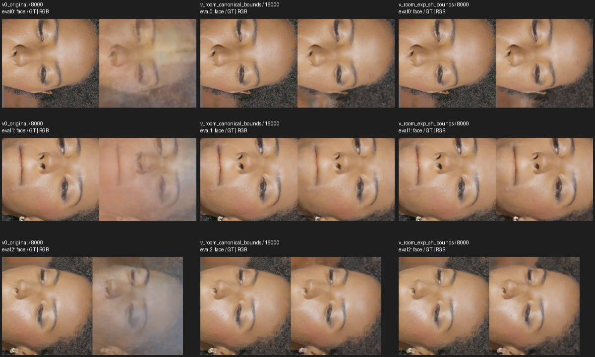

# Fresh LookCloser blur ablations

## What was tested

**Status: all lipstick validations and exponential/SH fight transfer are complete.
The final fight check for unit-gain identity is running. No new default is promoted.**

2026-09-29. Base `630d58bd`; historical candidate `8389770b`; working branch
`lookcloser-blur-validated`. Main is unchanged. Every run starts from random
weights with **seed 42**. No multi-seed sweep or optimizer resume was used.

The primary actor fix is density scale in scene units. Full-frame training has
an additional, substantial interaction between scene bounds, exponential density
and SH encoding. These are separate supervision domains; their scores must not
be pooled. The historical successful recipe trained a masked actor, not the room.

### Protocol

| Domain | Data and supervision | Configuration |
| --- | --- | --- |
| Synthetic diagnostic | One teacher train camera, two teacher eval cameras; valid pixels | 128 fixed samples, hash19, 2048 rays |
| Actual single-camera diagnostic | Actual train33 photo and mask; same camera evaluated | Diagnostic only, no held-out claim |
| Masked actor | 62 train / 3 eval, actual HD RGB, historical masks; AABB span .14812 | 256 fixed samples, hash21, uniform valid pixels; LR .01→.001 over 12000 |
| Full room | Same 62/3 actual RGB/calibration; all pixels | Hash23, 256-sample warmup through 4096 then adaptive sampling; LR .01→.0001 over 200000 |
| Fight `007740` | Original 66 train / 3 eval | Bounded Stage A, 30376 updates |

Real runs use 4096 rays, unchanged Charbonnier supervision and regularization.
Screens run 8000 steps, evaluating every 2000. Long lipstick validations run
24000, evaluating every 8000. Three train cameras and all three eval cameras
are rendered at native resolution. Actor FAS is disabled because the stock
frequency sampler does not preserve the valid-mask contract.

Metrics below are **PSNR ↑ / SSIM ↑ / LPIPS ↓** on native float RGB, unless
explicitly labeled diagnostic. “Detail” equally averages face, hair and lipstick
rectangles across three cameras: nine ROIs. Select checkpoints by mean
**full-frame all-eval PSNR**, with lower LPIPS breaking ties within **.07 dB**.
Matched-step comparisons are labeled separately.

The quality screen requires ≥.5 dB eval-detail gain, supporting SSIM/LPIPS and
visible train/eval improvement. Fight limits are .10 dB PSNR, .005 SSIM and
.01 LPIPS worsening, with no new visible defect. These are practical gates,
not significance tests. Available pairs have identical initial field weights
and first 32 sampled batches. Evaluation restores Python, NumPy and Torch RNG.
Bitwise GPU training and between-seed robustness are not claimed.

Fresh lipstick frequency maps use train RGB only: 16 levels, 1000 updates/level,
resolutions 16→8192, patch8 and SSIM threshold .95, following local
`Paper LookCloser.md`. Real training uses no teacher RGB/depth or Gaussian/NHT
output. Calibration and mesh-derived bounds/masks predate this campaign; they
do not establish an untouched holdout. This is a paired regression benchmark.
[Input hashes](assets/blur_ablation_fresh/real_input_hashes.json),
[fight hashes](assets/blur_ablation_fresh/fight_input_hashes.json),
[frozen ROIs](assets/blur_ablation_fresh/real_rois.json),
[all run histories and pair checks](assets/blur_ablation_fresh/campaign_evidence.json).

## Results

### 1. Density scale removes the small-actor collapse

At matched 2000 steps on the synthetic diagnostic, original softplus gives
20.233/.93720/.22891; FP32 alone gives 20.233/.93722/.22885; unscaled exponential
with FP32 gives 20.244/.94077/.22669. Changing only inverse-AABB scale with FP16
softplus gives **39.721/.98948/.00500**. On the actual single photo, scale changes
20.225/.93685/.23067 to **40.973/.99043/.00336**. These are masked, quantized
stride-2 diagnostics, not native scene scores.
[Diagnostics](assets/blur_ablation_fresh/single_metrics.json),
[actual-photo control](assets/blur_ablation_fresh/real_single_metrics.json).

The real actor factorial uses common corrected SH, FP32 activation and sampling:

| Actor, matched 8000 | Eval detail | Train detail PSNR |
| --- | --- | ---: |
| Softplus | 15.554 / .52192 / .82373 | 16.391 |
| Softplus / AABB span | 22.867 / .68308 / .39498 | 23.451 |
| Exponential, unscaled | 22.511 / .69306 / .38490 | 23.503 |
| Exponential / AABB span | 22.949 / .69176 / .37730 | 23.647 |

Scale adds **7.313 dB** to softplus; exponential adds only **.082 dB** once it is
scaled. Exponential alone also escapes collapse in this 62-image task, unlike
the single-camera diagnostic. Scale is effective, not the unique remedy.
[Factorial evidence](assets/blur_ablation_fresh/actor_density_factorial.json).

With legacy SH and FP16, scale alone gives 15.56894→22.42666 dB. Changing the
reference from 1 to 3 with legacy SH/FP32 gives 22.42303→23.02297 dB; removing
FP32 before softplus then gives 23.00029/.68400/.38814, only −.02268 dB.
Exponential and SH have small conditioned actor gains; together they add .52618 dB
and improve LPIPS .39890→.37730 over unit-scaled legacy-SH softplus. This is not
zero effect, but those changes are unnecessary for the main actor recovery.
[Legacy-convention pair](assets/blur_ablation_fresh/actor_original_scale_screen.json),
[reference/precision](assets/blur_ablation_fresh/actor_reference_precision_completed.json),
[conditioned activation/SH](assets/blur_ablation_fresh/actor_exp_sh_screen.json).

**Fresh 24k validation:** only canonical density normalization differs. Both
selectors choose step 16000.

| Selected actor checkpoint | Eval detail | Train detail |
| --- | --- | --- |
| Original, 16000 | 15.60872 / .50357 / .80802 | 16.47468 / .58100 / .70659 |
| Canonical scale, 16000 | **23.01250 / .67137 / .38289** | **23.65109 / .70683 / .39495** |

Gains are **+7.40378 dB eval** and **+7.17641 dB train**. At matched 24000, eval
PSNR is 15.60060→23.07434 and train is 16.51306→23.83073: more updates do not
rescue the original. Full-frame PSNR is low (9.64565→12.03851 at selection)
because background is unsupervised; it cannot establish room quality.
[Final validation](assets/blur_ablation_fresh/actor_final_validation.json).

**Measured mechanism:** on 1024 fixed valid train rays, original mean opacity is
.32790 and effective RGB is 100% saturated white. Canonical scaling gives .84253
opacity and 0% white saturation. On 64 fixed rays, the derivative of summed RGB
with respect to the color head has L2 norm 0 versus 171.61365. This supports color
saturation with opacity carrying grayscale structure; it is local sensitivity
evidence, not an explanation of every gradient or all blur mechanisms.
[Checkpoint-bound audit](assets/blur_ablation_fresh/actor_color_gradient.json).

All selected train/eval crops and the common 24-frame path were inspected.
Color and structure recover, while soft hair, train61 distortion and unknown
mask/background regions remain. [Train faces](assets/blur_ablation_fresh/actor_final/train_face.jpg),
[paired video](assets/blur_ablation_fresh/actor_final/comparison.mp4),
[path receipt](assets/blur_ablation_fresh/actor_final/actor_comparison_complete.json).

### 2. Full-room recovery depends on bounds and density/SH interaction

Tight bounds enclose historical actor/background geometry with 5% padding:
maximum side 1.45355 instead of 3. All RGB remains supervised. This is a dataset
recipe, not a per-pixel rendering correction.

| Room, matched 8000 | Eval detail | Train detail |
| --- | --- | --- |
| Original | 17.499 / .67597 / .66204 | 27.635 / .68848 / .56359 |
| Tight bounds only | 21.729 / .68824 / .53915 | 25.945 / .65297 / .56149 |
| Tight bounds + FP32 softplus | 22.196 / .69449 / .51367 | 26.031 / .65521 / .54451 |
| Tight bounds + FP32 exponential | 27.299 / .78209 / .32955 | 27.951 / .72167 / .41225 |
| Tight bounds + FP32 exponential + SH | **28.721 / .79622 / .29865** | **28.360 / .72861 / .39544** |
| Tight bounds + canonical softplus | 26.419 / .76474 / .36337 | 27.564 / .70788 / .44904 |
| Tight bounds + canonical softplus + SH | 27.647 / .77832 / .33809 | 27.844 / .71312 / .42778 |

Single-factor conclusions at this horizon:

- FP32 before softplus adds .46696 dB eval and .08625 dB train under tight bounds.
  This is below the .5 dB gate, not evidence of exactly zero effect. Severe ghosting remains.
- At the same precision/bounds/legacy SH, exponential adds **5.10270 dB eval** and
  **1.91978 dB train**. With SH already corrected, exponential adds **3.41379 dB eval**.
- With exponential/bounds fixed, corrected SH adds **1.42260 dB eval** and
  **.40876 dB train**, with better SSIM/LPIPS. With canonical softplus it adds 1.22842 dB eval.

[Precision/activation removal](assets/blur_ablation_fresh/room_fp32_removal_completed.json),
[activation with SH](assets/blur_ablation_fresh/room_exp_removal_completed.json),
[SH removal](assets/blur_ablation_fresh/room_sh_removal_completed.json),
[canonical SH control](assets/blur_ablation_fresh/room_canonical_sh_completed.json).

**Fresh 24k validations, selected by full eval PSNR:**

| Selected room checkpoint | Full eval | Eval detail | Train detail |
| --- | --- | --- | --- |
| Original, 8000 | 14.84278 / .73302 / .77618 | 17.37642 / .67559 / .66446 | 27.52424 / .68740 / .56408 |
| Canonical softplus + bounds, 16000 | 23.72593 / .82324 / .41159 | 27.26238 / .78446 / .31697 | 28.75700 / .74721 / .37132 |
| Exponential + SH + bounds, 8000 | **24.93983 / .83966 / .36401** | **28.33937 / .79299 / .30988** | 28.19536 / .72419 / .40069 |

The preferred room recipe gains **10.96295 dB eval detail** and **.67112 dB train**
over the long original control. The original screen's earlier selected 2000-step
checkpoint is a stronger full-frame baseline, **16.68988/.74761/.73014**; the new
recipe still exceeds it by **8.24995 dB**. It is retained explicitly rather than
hidden by the long runs' coarser evaluation cadence.

Canonical softplus is a simpler successful alternative. The exponential/SH
selection improves eval detail by 1.07698 dB over it, but its earlier selected
checkpoint has .56164 dB lower train detail. At matched 24000, exponential/SH
improves both: eval **28.96124 versus 27.25773**, train **29.68862 versus 29.01063**,
with better SSIM/LPIPS. The extra components therefore retain a substantial
conditioned effect; they are not required for every successful actor recipe.
[All final room histories](assets/blur_ablation_fresh/room_final_comparison.json).

All three eval and three train frames and face/hair/lipstick crops were reviewed.
Large eval ghosting disappears. Soft hair, train61 facial distortion and severe
local artifacts on train0's reflective lipstick remain.
[Full eval](assets/blur_ablation_fresh/room_final/eval_full.jpg),
[train faces](assets/blur_ablation_fresh/room_final/train_face.jpg),
[train lipstick](assets/blur_ablation_fresh/room_final/train_lipstick.jpg).
The preferred recipe stays improved throughout the common 24-frame camera path;
background rails and hand/lipstick still have local artifacts. All frames are
finite and full MP4 decoding passes. Novel path frames have no ground-truth scores.
[Paired video](assets/blur_ablation_fresh/room_exp_sh_final/comparison.mp4),
[all candidate frames](assets/blur_ablation_fresh/room_exp_sh_final/path_all_frames.jpg),
[receipt](assets/blur_ablation_fresh/room_exp_sh_final/comparison_complete.json).
The canonical-softplus alternative was also checked on all 24 frames of the
same path. Subject recovery persists, but its background has more blocky/floating
artifacts than the preferred recipe; its video also passes full decoding.
[Alternative video](assets/blur_ablation_fresh/room_final/canonical_comparison.mp4),
[all frames](assets/blur_ablation_fresh/room_final/canonical_path_all_frames.jpg),
[receipt](assets/blur_ablation_fresh/room_final/comparison_complete.json).

At 8000, training ray-point counts are original 20.297 billion, tight bounds
14.353, canonical/bounds 16.553 and exponential/SH/bounds 11.955. Recovery is not
explained by more sampled points. These are not matched FLOPs, and concurrent
per-job wall times are not directly comparable.
[Counts](assets/blur_ablation_fresh/room_sample_counts.json).

### 3. Original fight scene

| Selected at 30376 | PSNR | SSIM | LPIPS | Gate |
| --- | ---: | ---: | ---: | --- |
| Original | 29.47409 | .67341 | .29662 | Reference |
| SH only | 29.46895 | .66643 | .28515 | Fails SSIM |
| Softplus / AABB span | 28.76697 | .67299 | .31341 | Fails PSNR and LPIPS |
| Canonical 3/span, unconditional FP32 output | 29.42683 | .66527 | .29439 | Fails SSIM |
| Safe exponential + corrected SH | **29.51649** | **.67501** | **.29078** | **Passes all limits** |

All selected exponential/SH train/eval frames and saved hand/equipment crops
were inspected without a new conspicuous defect. This is a combined-recipe
transfer, not a separate attribution of each component on fight. It validates
Stage A, not the historical longer Stage-A→FR leader.
[Final metrics](assets/blur_ablation_fresh/fight_exp_sh_completed.json),
[full eval](assets/blur_ablation_fresh/fight_exp_sh_final/eval_full.jpg),
[train](assets/blur_ablation_fresh/fight_exp_sh_final/train_full.jpg),
[detail](assets/blur_ablation_fresh/fight_exp_sh_final/eval_fingers.jpg).

The original AABB has span 3, so 1/span reduces its density by three. Canonical
3/span preserves the reference scale, but an unconditional FP32 cast still
changes the numerical path. Its final SSIM decline .00814 fails the .005 gate,
despite passing at 15188. Visual similarity does not override that failure.
[Unit-reference failure](assets/blur_ablation_fresh/fight_unit_reference_completed.json),
[canonical failure](assets/blur_ablation_fresh/fight_canonical_completed.json).

The model now resolves an **exact unit gain** to the legacy field path, including
dtype. There is no dataset-name lookup or tuned tolerance. Occupancy updates
multiply density by a Python scalar: the previous cast changes all 65 audited
values, by up to 1.59e-5. This is a concrete numerical difference, not proof that
it caused the SSIM decline. The fresh identity run passes the intermediate gate
(−.03797 dB PSNR, −.00255 SSIM, −.00247 LPIPS); **its final result is pending**.
[Occupancy audit](assets/blur_ablation_fresh/unit_gain_occupancy_dtype.json),
[interim result](assets/blur_ablation_fresh/fight_identity_early.json),
[saved-config comparison](assets/blur_ablation_fresh/fight_canonical_config_diff.json),
[runtime revision audit](assets/blur_ablation_fresh/fight_runtime_audit.json).

### 4. Changes excluded from the retained recipes

| Control | Fresh finding |
| --- | --- |
| Room 1/span alone | +.119 dB eval detail; worse SSIM/LPIPS |
| Room FP32 softplus alone | −.060 dB eval detail |
| Room exponential alone, FP32 | +.234 dB versus FP32 softplus; worse SSIM/LPIPS |
| Room SH alone | −1.663 dB eval detail; effect is conditional |
| Warmup 1024 / no warmup | +.366 / +.697 dB detail, but strong ghosting remains |
| Faster LR decay / lower initial LR | −1.390 / −2.753 dB eval detail |
| Alternative frequency projection | −.019 / −.096 dB actor; −.162 dB room |
| Clipping, AMP scale, removing distortion | No substantial rescue in single-camera controls |
| Denser frozen rendering / allocator correction | Does not recover missing detail at tested checkpoints |

[Density controls](assets/blur_ablation_fresh/real_density_screen_initial.json),
[warmup](assets/blur_ablation_fresh/real_precision_warmup_screen.json),
[no warmup](assets/blur_ablation_fresh/real_no_warmup_screen.json),
[LR](assets/blur_ablation_fresh/real_lr_completed.json),
[actor projection](assets/blur_ablation_fresh/actor_frequency_projection_screen.json),
[room projection](assets/blur_ablation_fresh/room_frequency_projection_completed.json),
[frozen rendering](assets/blur_ablation_fresh/frozen_rendering.json).

Observed-background objectives, native patch supervision, matte/support repair,
pose refinement and teacher pretraining were **not freshly validated as incremental
improvements**. Recovery without them establishes that they are unnecessary for
this measured main collapse; it does not prove they have no other benefit.
Whole-network FP32 is not established as the cause of the historical jump.

## Retained implementation and reproduction

The field retains softplus, canonical density scale, safe exponential and an
opt-in SH direction correction. Exponential casts logits to FP32 **before** the
bias/activation, fixing demonstrated TCNN FP16 overflow. Canonical scaling uses
FP32 **after** activation, with the exact-unit-gain bypass described above.
SH maps unit directions to TCNN's [0, 1] domain. The preferred room recipe uses
exponential + SH + tight bounds without extra density normalization.

Clipping, separate precision/reference controls and alternative frequency
projection were removed. The full pre-cleanup ablation code is archived at
`lookcloser-blur-ablation-archive`, commit `7a6ffd5f`. Requests requiring those
removed controls use that version; the later identity test (`f7`) uses current
code. Incompatible research checkpoints fail explicitly rather than silently
changing their density math. Model-config legacy defaults remain unchanged;
standard-preset promotion awaits the final identity check.

**13 focused tests pass**, including optical thickness/gradients, FP32 exponential,
SH contract, both density-query paths, checkpoint guards and occupancy dtype.
Four pinned checkpoints were rendered on 1024 fixed valid train-0 rays before and
after cleanup: actor tensors are exact; adaptive RGB/opacity/depth differences
are below 1e-5, also the bound in an unchanged-code repeat. This is sampled
render parity, not an all-view or exact-resume proof.
[Cleanup parity](assets/blur_ablation_fresh/retained_formula_parity.json),
[identity parity](assets/blur_ablation_fresh/identity_render_parity.json).

[Runnable recipes](../recipes/blur_fixes/README.md) use repository runtime helpers.
`run_blur_experiment.py` executes one immutable request through the standard
Trainer update. `supervise_blur_campaign.py` logs controller/worker liveness,
progress, GPU memory and OOM evidence every 30 seconds. `review_blur_results.py`
rebuilds the paired evidence; `build_blur_review_panels.py` rebuilds the figures.
Large datasets, checkpoints and native images are at
`/home/brans/lookcloser_artifacts/blur_ablation_fresh`; source, recipes, reports
and compact review evidence are committed here. The requested Ubuntu Conda is
inaccessible; runs use `/home/brans/repos/nerfstudio/.venv`, Torch 2.7.1+cu128 and
one RTX PRO 6000. The installed imageio ffmpeg handles encoding and full decoding.

The 24 GPU-hour budget counts the union of active intervals on this shared GPU,
not the sum of concurrent job wall times. Supervision remains active until the
last training and visual gate finish. The authorized checkpoint cleanup removed
96.45 GiB of old files owned by `brans`; other users' files were untouched.
[Cleanup receipt](assets/blur_ablation_fresh/cleanup.jsonl).
