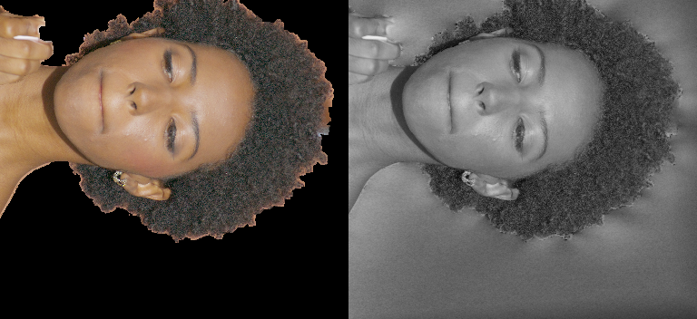
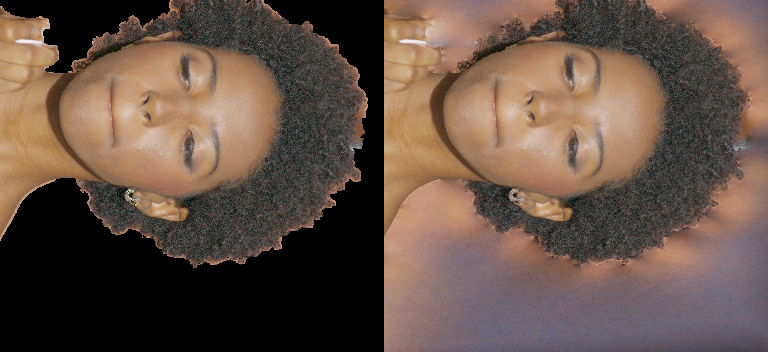

# Fresh single-seed LookCloser blur ablations

## What was tested

2026-09-29. In progress; no quality change promoted. Base `630d58bd`, candidate
archive `8389770b`, one seed (42), independently initialized experiments. Maximum
campaign budget: 24 GPU-hours. Main was not changed.

The density bundle is split into activation, inverse-AABB scale, precision and
clipping. SH remains an independent control. The diagnostic runner uses the
standard LookCloser pipeline and `Trainer.train_iteration`, including its normal
AMP/Adam/scheduler and callbacks. Evaluation preserves Python/NumPy/Torch RNG.
Initial field parameter digests and the first 32 sampled batches match across
the six initial density controls.

Synthetic diagnostic: one teacher train camera, two teacher validation cameras,
3000 updates, 2048 rays, fixed128, hash19, LR .01→.001, corrected SH. Valid-pixel
uniform sampling is shared by all controls; this differs from the historical
distillation loop and uses no teacher depth. Existing fitted frequency maps are
shared. Historical numbers are not used as a paired baseline.

Real benchmark: fixed calibrated RGB for DEC5 `000973`, 62 train / **3** eval,
1920×1080; the two additional held-out cameras use identity color profiles and
the same frozen exposure. No eval RGB fits a profile, geometry or frequency map.
The real room remains in training and full-frame evaluation. Native GT-only
detail rectangles are fixed before real training. Full-image frequency maps are
fitted on train images only, 1000 updates/level as in the local paper.

Fight control: `007740`, 66 train / 3 eval, inherited Stage-A model/optimizer
settings and 30376 updates. All quality claims must use fresh paired results.

Runtime: `/home/brans/repos/nerfstudio/.venv`, Torch 2.7.1+cu128, RTX PRO 6000.
The requested Ubuntu Conda is inaccessible. Large artifacts live under
`/home/brans/lookcloser_artifacts/blur_ablation_fresh`; source, requests and compact
evidence live in this repository. [Cleanup log](assets/blur_ablation_fresh/cleanup.jsonl)
records 96.45 GiB of intermediate, unlinked checkpoints owned by `brans`, with
run requests and retained best models. Other users' checkpoints were untouched.

## Results

The synthetic controls reproduce the gray training-view failure. Independent
FP32 and exponential activation controls do not remove it. Inverse-AABB scaling
of **softplus alone** restores color and detail. See the
[common-protocol metrics](assets/blur_ablation_fresh/single_metrics.json).
These are quantized stride-2 diagnostic renders, not native full-scene scores.

| Single-view control, step2000 | Train PSNR ↑ | SSIM ↑ | LPIPS ↓ |
| --- | ---: | ---: | ---: |
| Softplus | 20.233 | .93720 | .22891 |
| Only FP32 density | 20.233 | .93722 | .22885 |
| Exponential + FP32, unscaled | 20.244 | .94077 | .22669 |
| Only inverse-AABB scale, FP16 softplus | **39.721** | **.98948** | **.00500** |
| Scaled softplus + FP32 | 39.668 | .98959 | .00503 |
| Scaled exponential + FP32 | 39.999 | .98942 | .00443 |
| Add exponential clipping | 40.035 | .98944 | .00438 |
| Scaled softplus, legacy SH | 39.360 | .98868 | .00534 |
| Unscaled softplus, AMP scale65536 | 20.233 | .93735 | .22871 |
| Unscaled softplus, no distortion | 20.234 | .93748 | .22837 |

Each panel is GT left / learned RGB right. Unknown teacher background is not
supervised or counted in this table; its arbitrary prediction remains visible.

The [saved-field audit](assets/blur_ablation_fresh/saturation.json) evaluates
1024 fixed valid training rays. Both unscaled softplus and unscaled exponential
have opacity-normalized RGB exactly `[1,1,1]` on all sampled rays at the selected
step1000 checkpoint. They encode a grayscale image through opacity. With scaled
softplus the white-saturation fraction is zero and chroma is nonzero.

Seven numerical/GPU tests pass: legacy softplus identity; FP32 exponentiation
outside autocast; scaling of optical thickness and gradients; clipping;
independent SH addition-theorem reference; and agreement between field-query
and density/occupancy-query paths. Scene-quality acceptance remains pending.

## Insights and next steps

The early synthetic failure is an RGB saturation failure, not evidence that
exponential density is necessary. A density gain prevents this failure in the
small actor AABB. Increased AMP scale and removal of distortion do not fix the
same control. Transfer to real full-scene training is still unverified.

The final selector uses mean full-frame eval PSNR across all held-out cameras,
with LPIPS breaking ties within .07 dB. Matched-step comparisons remain separate.
Acceptance requires ≥.5 dB detail improvement with supporting SSIM/LPIPS and
visible train/eval improvement; fight tolerance is .10 dB PSNR / .005 SSIM /
.01 LPIPS with no new visible defect. No between-seed robustness is claimed.
