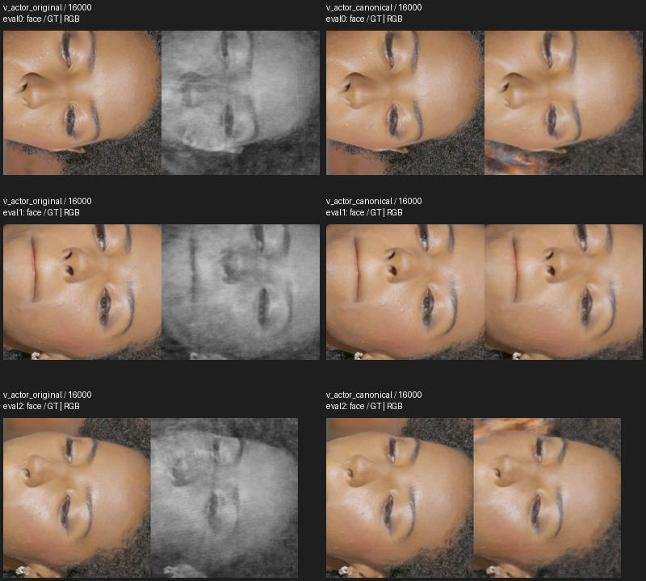
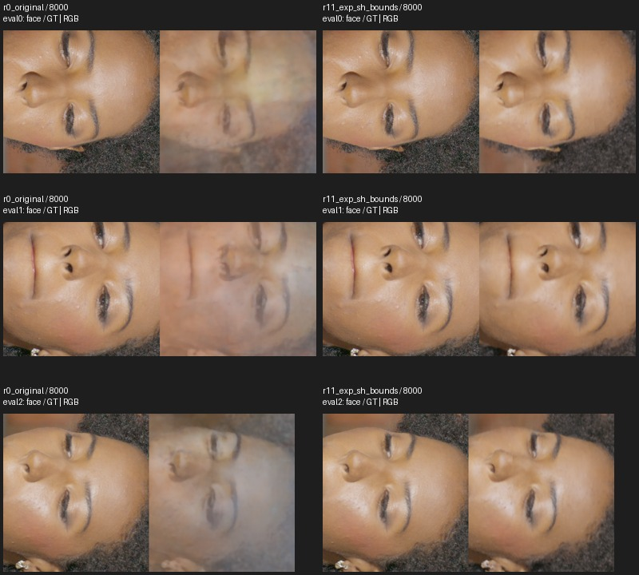

# Fresh LookCloser blur ablations

## What was tested

**Status: final validation is running. No quality change has been promoted.**
2026-09-29. Base `630d58bd`; previous candidates `8389770b`; working branch
`lookcloser-blur-validated`. Main is unchanged. Every experiment starts from
scratch with **seed 42**. There are no multi-seed sweeps.

The tests separate density activation, density scale, activation precision,
clipping, SH direction encoding, AABB bounds, sampling and frequency projection.
One-factor requests name a `comparison_parent`; the supervisor rejects requests
that change more than one condition. Final recipe transfers are identified
separately and do not claim single-factor attribution.

### Protocol and domains

| Domain | Images and supervision | Training protocol |
| --- | --- | --- |
| Synthetic diagnostic | One teacher train camera, two teacher eval cameras; valid pixels only | 3000 updates, 128 fixed samples, `log2_hashmap_size=19`, 2048 rays |
| Actual single-camera diagnostic | Actual train33 photo and its valid mask; same camera used for evaluation | Diagnostic only; no held-out claim |
| Real masked actor | 62 train / 3 eval, actual HD RGB, historical train masks, actor AABB span .14812 | 256 fixed samples, `log2_hashmap_size=21`, uniform valid-pixel sampling, LR .01→.001 over 12000 |
| Real full frame | Same 62/3 actual HD RGB and calibration; all pixels supervised | `log2_hashmap_size=23`, 256-sample warmup through 4096 then adaptive sampling, LR .01→.0001 over 200000 |
| Fight `007740` | 66 train / 3 eval | Original bounded Stage-A configuration, 30376 updates |

Real experiments use4096 rays, Charbonnier RGB supervision and the same
regularization. Real screens run8000 updates with evaluation every2000;
long validation runs24000 with evaluation every8000. Three train cameras
(indices0, 33, 61) are inspected alongside all three eval cameras.

The historical successful real-only recipe trained the **masked actor in a small
AABB**. It did not train the whole room. Both domains are tested here. Actor
background is unsupervised; its full-frame score cannot establish room quality.
Historic masks exclude some hair/object pixels and were not repaired for these
controls. Masked-actor FAS is disabled because the stock frequency sampler does
not preserve the valid-pixel mask contract.

Calibration and mesh-derived bounds/masks predate this campaign. Their provenance
does not establish an untouched holdout. This is a paired regression benchmark.
The new full-image frequency maps use train RGB only:16 levels, 1000 updates per
level, resolutions16→8192, patch8, SSIM threshold .95, following the local
`Paper LookCloser.md`. No teacher RGB/depth or Gaussian/NHT output supervises
real-scene training. [Real input hashes](assets/blur_ablation_fresh/real_input_hashes.json),
[fight hashes](assets/blur_ablation_fresh/fight_input_hashes.json),
[fixed GT-only detail rectangles](assets/blur_ablation_fresh/real_rois.json).

All scene tables use native float RGB PSNR/SSIM/LPIPS. “Detail” is the equal-weight
mean over face/hair/lipstick rectangles across three cameras: nine rectangles.
Checkpoint selection uses mean **full-frame all-eval PSNR**, with LPIPS breaking
ties within .07 dB. Matched-step tables are labeled separately.

The screen requires ≥.5 dB eval-detail gain with supporting SSIM/LPIPS and visible
train/eval improvement. Fight tolerances are .10 dB PSNR, .005 SSIM, .01 LPIPS,
with no new visible defect. These are practical gates, not significance tests.
Initial field weights and first 32 sampled batches match in every available
paired comparison. No between-seed robustness or bitwise GPU reproducibility is
claimed. Evaluation restores Python, NumPy and Torch CPU/CUDA RNG states.

## Results

### 1. Density scale removes the small-AABB color collapse

| Single-view diagnostic, matched 2000 | PSNR ↑ | SSIM ↑ | LPIPS ↓ |
| --- | ---: | ---: | ---: |
| Synthetic softplus | 20.233 | .93720 | .22891 |
| Only FP32 density | 20.233 | .93722 | .22885 |
| Exponential + FP32, unscaled | 20.244 | .94077 | .22669 |
| Only inverse-AABB scale, FP16 softplus | **39.721** | **.98948** | **.00500** |
| Actual single photo, original | 20.225 | .93685 | .23067 |
| Actual single photo, only scale | **40.973** | **.99043** | **.00336** |

These are masked, quantized stride-2 diagnostics, not native scene scores.
[Synthetic controls](assets/blur_ablation_fresh/single_metrics.json),
[actual-photo controls](assets/blur_ablation_fresh/real_single_metrics.json).
Increasing the AMP scale or removing distortion did not rescue the same collapse.
Clipping the scaled exponential gave only a small additional diagnostic change.

The real 62/3 foreground factorial separates activation from scale. All four rows
below share corrected SH, FP32 activation and the same fixed-sampling recipe.

| Actor, matched 8000 | Eval-detail PSNR / SSIM / LPIPS | Train-detail PSNR |
| --- | --- | ---: |
| Softplus | 15.554 / .52192 / .82373 | 16.391 |
| Softplus / AABB span | **22.867 / .68308 / .39498** | 23.451 |
| Exponential, unscaled | 22.511 / .69306 / .38490 | 23.503 |
| Exponential / AABB span | 22.949 / .69176 / .37730 | 23.647 |

Scale adds7.313 dB to softplus; exponential adds only .082 dB once softplus is
scaled. Unlike the single-camera diagnostic, exponential alone also escapes
collapse in the 62-image task. Scale is effective, not the only possible remedy.
[Full factorial](assets/blur_ablation_fresh/actor_density_factorial.json).

With **legacy SH and FP16**, changing only1/span gives15.56894→22.42666 dB.
Thus the scale effect does not depend on first correcting SH.
[Original-convention pair](assets/blur_ablation_fresh/actor_original_scale_screen.json).
With legacy SH and FP32, changing the reference from 1 to 3 gives
22.42303→23.02297 dB. Removing FP32 before softplus then gives
**23.00029 / .68400 / .38814**: only -.02268 dB, with better LPIPS.
FP32 multiplication after activation remains in the canonical-scale implementation.
[Reference and precision controls](assets/blur_ablation_fresh/actor_reference_precision_completed.json).

SH and exponential each have small conditioned gains in the foreground task.
Their combined gain over unit-scaled legacy-SH softplus is .52618 dB and LPIPS
.39890→.37730; this cumulative tradeoff is not described as zero.
[Conditioned SH/activation records](assets/blur_ablation_fresh/actor_exp_sh_screen.json).

**Measured mechanism.** On 1024 fixed valid training rays, original legacy
softplus has mean opacity .32790 and 100% white saturation after dividing RGB
by opacity. Canonical-scaled softplus has opacity .84253 and 0% white saturation.
For 64 fixed rays, the derivative of summed RGB with respect to the color head
has L2 norm0 versus 171.61365. These measurements support sigmoid saturation
with opacity carrying grayscale structure. They are local sensitivity evidence,
not a claim that every training gradient or all blur mechanisms are explained.
[Checkpoint-bound color/gradient audit](assets/blur_ablation_fresh/actor_color_gradient.json).

The fresh24k actor pair is complete. Both selectors choose16000 (full PSNR
within .07 dB of the maximum, lower LPIPS). Only canonical density normalization
differs between these two requests.

| Selected actor checkpoints | Full PSNR / SSIM / LPIPS | Eval detail PSNR / SSIM / LPIPS | Train detail PSNR / SSIM / LPIPS |
| --- | --- | --- | --- |
| Original,16000 | 9.64565 / .39093 / .88535 | 15.60872 / .50357 / .80802 | 16.47468 / .58100 / .70659 |
| Canonical scale,16000 | **12.03851 / .55391 / .59894** | **23.01250 / .67137 / .38289** | **23.65109 / .70683 / .39495** |

At matched24000, eval detail is15.60060 versus23.07434 dB; train detail is
16.51306 versus23.83073. Extra updates do not rescue the original collapse.
The selected pair improves eval detail by7.40378 dB and train detail by7.17641.
[Completed long validation](assets/blur_ablation_fresh/actor_final_validation.json).

[Training faces](assets/blur_ablation_fresh/actor_final/train_face.jpg),
[eval hair](assets/blur_ablation_fresh/actor_final/eval_hair.jpg),
[eval lipstick](assets/blur_ablation_fresh/actor_final/eval_lipstick.jpg),
[training lipstick](assets/blur_ablation_fresh/actor_final/train_lipstick.jpg).
Color and facial structure recover across the reviewed cameras. Hair remains
soft, train61 has facial distortion, and unknown mask/background regions remain
poorly modeled. This is recovery from the severe collapse, not complete detail
recovery or a full-room result.

### 2. Full-frame training needs a separate bounds interaction

“Tight bounds” enclose the historical actor/background geometry with 5% padding;
the maximum side is 1.45355, versus the original3. All room RGB remains supervised.
The bounds are a data recipe, not a per-pixel rendering correction.

| Full frame, matched 8000 | Full eval PSNR / SSIM / LPIPS | Eval detail PSNR / SSIM / LPIPS | Train detail PSNR / SSIM / LPIPS |
| --- | --- | --- | --- |
| Original | 14.797 / .73208 / .77829 | 17.499 / .67597 / .66204 | 27.635 / .68848 / .56359 |
| Only tighter bounds | 21.311 / .77495 / .52494 | 21.729 / .68824 / .53915 | 25.945 / .65297 / .56149 |
| Tight bounds + canonical-scaled softplus | **23.546 / .81642 / .42234** | **26.419 / .76474 / .36337** | 27.564 / .70788 / .44904 |
| Tight bounds + FP32 exponential | 23.406 / .82677 / .39479 | 27.299 / .78209 / .32955 | 27.951 / .72167 / .41225 |
| Tight bounds + FP32 exponential + SH | **24.966 / .83957 / .36379** | **28.721 / .79622 / .29865** | **28.360 / .72861 / .39544** |

The last bundle passes the8000-step quality screen: +11.223 dB eval detail,
+.725 dB train detail, better SSIM/LPIPS, and visible recovery across all three
eval cameras. The canonical-softplus alternative also removes much ghosting;
its train PSNR is .071 dB below original, with better train SSIM/LPIPS.
[Matched and selected bundle records](assets/blur_ablation_fresh/room_exp_sh_bounds_completed.json),
[canonical-softplus records](assets/blur_ablation_fresh/room_canonical_bounds_completed.json).

The original screen selects2000, full16.68988 / .74761 / .73014. The improved
room variants select8000. The independent original 24k run remains blurred;
at 24000 full PSNR is 14.41886 and detail17.37254 / .68612 / .62831.
Its selected 8000 checkpoint is weaker than the original screen's early2000
checkpoint, which must remain visible in any final selected-checkpoint comparison.
[Long original room control](assets/blur_ablation_fresh/real_original_long.json).

The adaptive runs use different numbers of training ray points: original20.297
billion, tight bounds14.353, canonical-softplus/bounds16.553, exp+SH/bounds11.955.
The large gain is not explained by more sampled points. These counts are a
compute proxy, not matched FLOPs; per-job wall times are not directly comparable
because the jobs shared a GPU. [Recorded counts](assets/blur_ablation_fresh/room_sample_counts.json).

At 8000, removing SH from the tight-room exponential recipe lowers eval detail
28.72132→27.29872 dB and train detail 28.35982→27.95106, with worse SSIM/LPIPS.
SH has a substantial conditioned contribution in this domain.
[Completed removal](assets/blur_ablation_fresh/room_sh_removal_completed.json),
[faces](assets/blur_ablation_fresh/room_sh_removal_eval_face.jpg),
[hair](assets/blur_ablation_fresh/room_sh_removal_eval_hair.jpg).
At 8000, replacing exponential with softplus while keeping SH/FP32 lowers
eval detail 28.72132→25.30754 dB and train detail 28.35982→26.95908.
SSIM and LPIPS also worsen. Exponential has a substantial conditioned effect
at this horizon. [Completed removal](assets/blur_ablation_fresh/room_exp_removal_completed.json),
[eval faces](assets/blur_ablation_fresh/room_exp_removal_eval_face.jpg).
Weak foreground SH effects must not be extrapolated to this room interaction.
Canonical-scaled softplus + SH is being
tested as a possible replacement for exponential. The 24k exponential/SH room
validation is running alongside a fresh 24k canonical-softplus/bounds control.

[Train faces](assets/blur_ablation_fresh/room_bounds8k_train_face.jpg),
[eval hair](assets/blur_ablation_fresh/room_bounds8k_eval_hair.jpg),
[eval lipstick](assets/blur_ablation_fresh/room_bounds8k_eval_lipstick.jpg),
[canonical-softplus comparison](assets/blur_ablation_fresh/room_canonical_eval_face.jpg).
Some hair softness and train61 facial distortion remain.

### 3. Original-scene regression checks

| Fight, 30376 updates, selected | PSNR ↑ | SSIM ↑ | LPIPS ↓ | Gate |
| --- | ---: | ---: | ---: | --- |
| Original | 29.47409 | .67341 | .29662 | Reference |
| Only SH correction | 29.46895 | .66643 | .28515 | Fails SSIM tolerance |
| Softplus / AABB span | 28.76697 | .67299 | .31341 | Fails PSNR and LPIPS |

[Original metrics](assets/blur_ablation_fresh/fight_baseline_metrics.json),
[unit-reference completed pair](assets/blur_ablation_fresh/fight_unit_reference_completed.json).
This is a fresh Stage-A check, not the historical longer Stage-A→FR leader.

The [original fight AABB has span3](assets/blur_ablation_fresh/canonical_reference.json).
Consequently1/span reduces its density by 3. The canonical control uses3/span,
a single global reference length anchored to this original coordinate scale.
At span3, optical thickness and gradients match legacy arithmetic exactly in
numerical tests; uniform coordinate scaling preserves optical thickness for corresponding samples.
FP32 multiplication prevents overflow in tiny world units.

At 15188, original versus canonical-reference gives
**28.77557 / .65091 / .36464 → 28.81332 / .64847 / .35851**.
All three deltas pass the predefined intermediate tolerances. The final30376
result is pending. [Native intermediate pair](assets/blur_ablation_fresh/fight_canonical_early.json).
The safe-exponential + SH room recipe is also undergoing fresh fight transfer
with the original fight bounds. That is a combined recipe check, not an
independent precision/SH attribution on fight.

### 4. Controls that do not explain the main recovery

| Control | Fresh measured result / decision |
| --- | --- |
| Whole-room1/span alone | +.119 dB eval detail at 8000, worse SSIM/LPIPS; fails main quality gate |
| Whole-room FP32 softplus alone | -.060 dB eval detail; no substantial gain |
| Whole-room exponential alone, FP32 | +.234 dB versus FP32 softplus, worse SSIM/LPIPS |
| Whole-room SH alone | -1.663 dB eval detail; its effect is conditional on the recipe |
| Warmup1024 instead of 256 | +.366 dB detail; strong ghosting remains |
| No warmup | +.697 dB detail, but strong ghosting remains; not the main cure |
| Faster LR decay / lower initial LR | -1.390 / -2.753 dB eval detail |
| Corrected frequency projection | -.019 / -.096 dB in the two actor controls; -.162 dB in full-frame training |
| Denser frozen rendering / allocator correction | Does not recover missing detail at the tested checkpoints |

[Density/precision controls](assets/blur_ablation_fresh/real_density_screen_initial.json),
[activation controls](assets/blur_ablation_fresh/real_exp_screen.json),
[precision and warmup](assets/blur_ablation_fresh/real_precision_warmup_screen.json),
[no-warmup](assets/blur_ablation_fresh/real_no_warmup_screen.json),
[LR controls](assets/blur_ablation_fresh/real_lr_completed.json),
[actor frequency controls](assets/blur_ablation_fresh/actor_frequency_projection_screen.json),
[room frequency control](assets/blur_ablation_fresh/room_frequency_projection_completed.json),
[frozen rendering](assets/blur_ablation_fresh/frozen_rendering.json),
[actor rendering](assets/blur_ablation_fresh/actor_scaled_rendering_audit.json).

The SH encoding contract and frequency-projection units have numerical tests;
mathematical correctness does not establish an image-quality gain. Explicit
FP32 before exponential fixes a demonstrated overflow. This does not establish
that whole-network FP32 caused the historical quality jump.

Observed-background objectives, native patch supervision, matte/support repair,
pose refinement and teacher pretraining are **not freshly validated here as
incremental improvements**. Recovery without them shows they are unnecessary
for the measured main collapse; it does not prove they have no other benefit.
The historical candidate branch remains provenance, not fresh paired evidence.

## Insights, remaining work and reproducibility

The small-actor failure and the full-frame ghosting are distinct. Density scale
is the clearest isolated actor fix. Tight bounds interact strongly with density
parameterization and SH in the room task. Final retention depends on the pending
component-removal and transfer results; there is no claim of complete texture
recovery, all-seed robustness or unseen-benchmark generalization.

Remaining: finish long room and fight checks; choose the smallest recipe
passing both domains; save its selected native outputs and common camera path;
remove unused production controls; run focused checks and commit the final code,
recipes, architecture note and report.

The selected actor pair has24 finite learned-RGB frames on exactly identical
interpolated camera paths. [Paired video](assets/blur_ablation_fresh/actor_final/comparison.mp4),
[paired contact sheet](assets/blur_ablation_fresh/actor_final/actor_comparison_contact.jpg),
[paired receipt](assets/blur_ablation_fresh/actor_final/actor_comparison_complete.json).
The color collapse is removed along the reviewed path; mask/background artifacts
and soft detail remain. The original actor path is also recorded separately.
[Path receipt](assets/blur_ablation_fresh/actor_original_path_complete.json),
[contact sheet](assets/blur_ablation_fresh/actor_original_path_contact.jpg).
Interpolated views have no ground-truth scores. A system ffmpeg library mismatch
was handled with the installed imageio encoder; full video decoding passed.
The renderer now records completed frames before encoding and can retry encoding.

Runtime: `/home/brans/repos/nerfstudio/.venv`, Torch 2.7.1+cu128, RTX PRO 6000.
The requested Ubuntu Conda is inaccessible. The runner uses standard
`Trainer.train_iteration`, AMP/Adam/scheduler and callbacks. Requests and compact
evidence are under `experiments/assets/blur_ablation_fresh`; large checkpoints,
PNGs and MP4s are under `/home/brans/lookcloser_artifacts/blur_ablation_fresh`.
Use `scripts/run_blur_experiment.py REQUEST.json` for an individual fresh run;
`scripts/supervise_blur_campaign.py MANIFEST.json` adds process/GPU/budget logs.
`scripts/review_blur_results.py` checks paired evidence;
`scripts/build_blur_review_panels.py` rebuilds labeled sheets from saved crops.
Training requests cannot overwrite existing histories.

The 24 GPU-hour budget uses the union of active intervals on one shared GPU,
including setup/evaluation. Concurrent job wall times are also logged as an
upper bound, not actual GPU-hours. Live jobs are checked much more often than
hourly, recording controllers, workers, progress, GPU memory and OOM evidence.
[Cleanup receipt](assets/blur_ablation_fresh/cleanup.jsonl) records96.45 GiB of
old intermediate checkpoints owned by `brans`; other users' files were untouched.
Completed work is committed on the working branch. Earlier chronological notes
remain in Git history; this report summarizes the current measured conclusions.

### Production cleanup and checkpoint compatibility

The complete ablation implementation is preserved in branch
`lookcloser-blur-ablation-archive`, commit `7a6ffd5f`; use it to replay the raw
historical requests. The working implementation removes clipping, a separate
pre-activation precision switch, arbitrary density reference length and the
alternative frequency-projection control. Safe exponential casts before the
bias/activation; canonical density scales in FP32 afterwards. Legacy softplus
remains available. Final preset promotion awaits the completed fight check.

A reference-three historical checkpoint maps to canonical normalization.
Checkpoints requiring removed math fail explicitly and must use the archived
code. Four pinned checkpoints were rendered on 1024 fixed valid train-0 rays
before/after cleanup: actor tensors match exactly; adaptive RGB, opacity and
depth differ by less than 1e-5, also the bound in an unchanged-code repeat.
This is a sampled parity check, not an all-view proof. Twelve focused tests pass.
[Parity evidence](assets/blur_ablation_fresh/retained_formula_parity.json).

The long full-room control's selected8k path contains severe translucent/ghost
artifacts throughout the inspected frames. All24 frames are finite and the
encoded video decodes fully.
[Contact](assets/blur_ablation_fresh/room_original_path_contact.jpg),
[receipt](assets/blur_ablation_fresh/room_original_path_complete.json).

### SH with canonical softplus and tight room bounds

At8k, adding only corrected SH to canonical softplus (`r18`→`r20`) improves
held-out detail26.41853/.76474/.36337→27.64696/.77832/.33809 and train detail
27.56385/.70788/.44904→27.84404/.71312/.42778. Full eval is23.99571/.82492/.40123.
All three eval face/hair crops and all three train faces were inspected: facial
shape improves, but hair stays soft and train61 remains distorted. The safe
exponential+SH+tight-bounds recipe (`r11`) still exceeds this alternative by
1.07437 dB eval detail and .51578 dB train detail at the same step. That last
comparison changes activation and normalization together; it is a recipe
comparison, not a one-factor attribution.
[Metrics](assets/blur_ablation_fresh/room_canonical_sh_completed.json),
[eval faces](assets/blur_ablation_fresh/room_canonical_sh/eval_face.jpg),
[eval hair](assets/blur_ablation_fresh/room_canonical_sh/eval_hair.jpg),
[train faces](assets/blur_ablation_fresh/room_canonical_sh/train_face.jpg).
