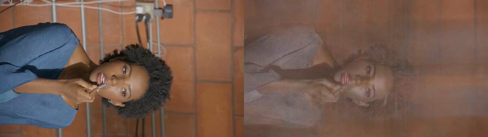

# DEC5 frame 000899: held-out camera ladder

## What was tested

- One physical eval camera, `F004_B005_1210O9`, held out by filename and image hash.
- Its 16 nearest eligible physical cameras are train-only. The four immediate camera-array
  neighbours `E004_B`, `G004_B`, `F004_A`, and `F004_C` bracket the eval view, so this is an
  interpolation rather than train-view duplication or a one-sided extrapolation test.
- Full-frame 1920x1080 JPEG supervision, no masks, U-Net, LPIPS training loss, appearance
  embeddings, FAS, frequency grid, or feature re-weighting.
- `focus/up`, auto pose scale, `scene_scale=1`, black background, 4096 train rays/update, and fixed
  4096 dense samples/ray. The only first-stage differences are train-camera count and iterations.
- The immutable derived dataset records source hashes, nearest-camera distances, held-out status,
  and sparse-Ply provenance in `nearest_camera_eval`.

## Results

| Configuration | Step | PSNR | SSIM | LPIPS | Visual result |
|---|---:|---:|---:|---:|---|
| 16 cameras, fixed 4096, `softplus(+1)` | 4k | 18.4976 | 0.758274 | 0.589934 | severe translucent ghosting over person and background |
| Same `softplus(+1)` continuation | 8k | 18.2338 | 0.758108 | 0.564220 | ghost geometry persists; PSNR regresses and SSIM is flat |
| Matched scratch `softplus(-4)` | 4k | 17.2604 | 0.726985 | 0.821640 | dark desaturated volume; density bootstrap fails |
| Matched scratch `softplus(-2)` | 4k | 19.1056 | 0.739159 | 0.608534 | less bright fog, but multiple projections remain |
| 32 cameras, fixed 4096, `softplus(+1)` | 8k | 18.1370 | 0.762583 | 0.595034 | matched exposure; translucent volume persists |
| 32 cameras + sparse COLMAP expected-depth, fixed 4096, `softplus(+1)` | 4k | 18.6475 | 0.760933 | 0.569179 | modestly denser actor, but broad translucent geometry and duplicated projections remain |
| 32 cameras, robust SfM AABB `±0.15`, RGB only | 4k | 21.9281 | 0.773519 | 0.532102 | main fog collapses; one coherent actor appears, with residual facial/background blur |
| Same robust-AABB continuation | 8k | 21.9141 | 0.782216 | 0.488057 | PSNR tie; SSIM and LPIPS improve materially, residual blur remains |
| Same robust-AABB continuation | 12k | 21.9019 | 0.785743 | 0.468533 | LPIPS still improves, but SSIM increment falls below the 0.005 continuation gate |
| All 62 cameras, auto SfM AABB `±0.12905`, RGB only | 4k | 21.7302 | 0.767266 | 0.563170 | coherent but undertrained actor; about half the per-camera exposure of 32 cameras at the same step |
| Same all-62 continuation | 8k | 22.0169 | 0.776286 | 0.534648 | active improvement; approximately matches 32-camera step4k at equal per-camera ray exposure |
| Same all-62 continuation | 12k | 22.0921 | 0.781357 | 0.521140 | still just above the SSIM continuation gate; visual silhouette/hair improve slightly |
| Same all-62 continuation | 16k | 22.0605 | 0.783651 | 0.511816 | plateau: face, hair and brick background remain softly doubled |
| All 62, auto scalar AABB + sparse expected depth `0.001` | 4k | 22.1471 | 0.768778 | 0.570567 | higher PSNR but perceptual blur is not improved; face/background remain broadly doubled |
| All 62, off-centre per-axis SfM AABB, RGB only | 4k | 17.5690 | 0.697688 | 0.853457 | catastrophic under-fit; grey translucent volume and no usable full-frame reconstruction |
| Stock bounded Instant-NGP, all 62, full `scene_scale=1` | 8k | 20.0845 | 0.745684 | 0.666094 | less uniformly foggy than LookCloser's large-box result, but face, hair, clothes, and background remain severely blurred |
| Same stock bounded Instant-NGP continuation | 16k | 19.2965 | 0.746037 | 0.680829 | held-out quality regresses while the translucent multi-view reconstruction persists |
| Clean Splatfacto, all 62, COLMAP-point initialization | 10k | 23.1480 | 0.794913 | 0.556179 | actor is sharp down to eyes, lipstick, hair, and fabric; poorly supported brick background is blocky/smeared and dominates full-frame LPIPS |
| Stock Nerfacto, all 62, no appearance/camera embeddings | 2k | 14.7440 | 0.661040 | 0.916664 | best checkpoint; train and eval are both diffuse, with displaced/missing actor geometry in eval |
| Same stock Nerfacto | 8k | 14.6080 | 0.650600 | 0.916686 | no recovery: PSNR and SSIM regress and the broad volume persists |
| LookCloser, sparse expected-depth weight `0.1` | 4k | 22.0548 | 0.771321 | 0.558833 | stronger geometric force makes the actor slightly denser but face, lipstick, and background remain doubled |
| LookCloser, one global JPEG exposure for all cameras | 4k | 20.7789 | 0.741254 | 0.568846 | photometrically faithful input is harder to fit and does not collapse the broad density |
| LookCloser, sparse surface-distribution depth `0.01`, sigma `0.005` | 4k | 22.1359 | 0.775138 | 0.537590 | modestly denser silhouette/hair, but eyes, lipstick, and background remain doubled |
| Same model continued RGB-only | 6k | 22.0490 | 0.781397 | 0.511813 | SSIM and LPIPS still improve, but broad facial/background doubling remains |
| LookCloser, GLOMAP poses+intrinsics, fixed normalized AABB | 4k | 22.7271 | 0.767918 | 0.531226 | denser and better positioned actor, but broad double face/hair/background remains |
| LookCloser, dense Splatfacto depth for first 2k, then RGB-only | 4k | 22.0930 | 0.775270 | 0.547212 | coherent teacher surface does not remove the multi-layer face or background blur |
| LookCloser, supplied calibration, distortion `0.1` | 4k | 23.2965 | 0.775679 | 0.555795 | denser silhouette and better PSNR, but face/hair/background remain doubled |
| Same weights, fresh RGB continuation (effective 6k) | 6k | 23.3461 | 0.768126 | 0.455366 | large LPIPS drop but SSIM regresses; broad ghost remains visible |
| Same weights, second fresh RGB continuation (effective 8k) | 8k | 23.4590 | 0.757822 | 0.447666 | PSNR/LPIPS improve slowly while SSIM collapses; visual doubling remains |
| LookCloser, train-only `SO3xR3` camera optimizer, corrected AABB-collider order | 2k | 18.9151 | 0.731204 | 0.739391 | pose drift makes held-out geometry substantially worse |
| Same camera-optimizer run | 4k | 18.9204 | 0.727326 | 0.731403 | catastrophic multi-layer actor/background; rejected and checkpoint removed |
| LookCloser, GLOMAP poses+intrinsics + distortion `0.1` | 2k | 22.9629 | 0.769563 | 0.523283 | complementary early LPIPS gain, but face remains doubled |
| Same combined run | 4k | 23.9989 | 0.779574 | 0.522578 | new PSNR leader and active SSIM growth; visually denser but still two-layer face/hair |
| Same weights, fresh continuation (effective 6k) | 6k | 24.1237 | 0.774487 | 0.461199 | LPIPS improves strongly, but SSIM regresses and visible facial ghost remains |
| LookCloser, dense Splatfacto depth `0.01`, sigma `0.002` for first 2k | 2k | 22.1642 | 0.773137 | 0.546746 | stronger teacher improves early structure versus weight `0.001` |
| Same run, teacher off after 2k | 4k | 22.4890 | 0.782357 | 0.509294 | denser single actor and weaker ghost; face remains soft and background inherits depth artifacts |
| LookCloser, dominant dense Splatfacto depth `0.1` for first 2k | 2k | 23.0719 | 0.776550 | 0.562080 | strongest single-surface bootstrap; best PSNR occurs before RGB-only phase |
| Same run, teacher off after 2k | 4k | 22.7178 | 0.786503 | 0.494940 | cleaner actor contour, but PSNR regresses and face/background remain soft/artifacted |
| Clean Splatfacto, GLOMAP poses+intrinsics, no image-space auxiliaries | 10k | 23.4009 | 0.803110 | 0.539988 | sharp actor and face, but plastic local detail and severe unsupported-background splat artifacts |
| LookCloser, matched GLOMAP Splat depth `0.01` + GLOMAP calibration + distortion `0.1` | 2k | 23.6669 | 0.777552 | 0.482980 | matched teacher weakens the broad ghost while preserving a coherent actor |
| Same matched run, teacher off after 2k | 4k | 24.1580 | 0.791053 | 0.462913 | best balanced volumetric endpoint at this boundary; face still soft |
| Same weights, fresh RGB continuation (effective 6k) | 6k | 24.3107 | 0.794451 | 0.426196 | all metrics improve, but SSIM gain is below the `0.005` continuation gate and face micro-detail remains soft |

The step-4k render is a genuinely held-out camera. Unlike the sharp duplicated-view gate, it shows
multiple semi-transparent projections and a depth visualization correlated with image texture
rather than a clean front surface.

Run:
`/home/brans/lookcloser_temp/lookcloser_runs/dec5_000899_heldout_camera_ladder/lookcloser/camera16_eval1_focus_scene1_fixed4096_softplus_densityp1_black_uniform4096_noappearance_nofreq_s42_to16k`

## Insights

1. Fixed-4096 removes most train-view blur but does not by itself establish view-consistent
   geometry. The 4k held-out failure is qualitatively volumetric ghosting, not only insufficient
   spatial resolution.
2. Step 4k exposes only about `0.494` sampled train rays per source pixel on average. A continuation
   to 8k distinguishes ordinary under-training from a persistent geometry failure: PSNR regresses
   `0.2638` dB, SSIM changes by `-0.000166`, and the second translucent projection remains.
3. The dense fixed marcher does not use occupancy pruning. Around zero raw network output,
   `softplus(+1)` initializes density to `1.3133`, giving approximately `0.928` opacity across a
   two-unit AABB. `softplus(-4)` initializes to `0.01815`, approximately `0.03565` opacity. This is
   the next controlled A/B if the 8k continuation does not rapidly collapse the ghost volume.
   The `-4` endpoint is too sparse for this field: at 4k it is worse than `+1` on all three held-out
   metrics and remains a dark, desaturated volume. The next test narrows the bracket to `-2`.
4. The nearest-16 set excludes the calibration audit's principal repeatable outliers. Calibration
   remains a possible secondary limit, but it is not the leading explanation for this early broad
   density volume.
5. Density initialization is not the primary geometry fix. `-2` successfully bootstraps and gains
   `0.6080` dB PSNR over `+1` at 4k, but loses `0.01912` SSIM and `0.01860` LPIPS; visually it only
   darkens the fog while retaining duplicated face, clothing and brick projections. Historical
   `+1` remains the better perceptual baseline for the camera-count test.
6. Doubling camera count is also insufficient at matched ray exposure. Relative to 16 cameras/4k,
   32 cameras/8k changes PSNR/SSIM/LPIPS by `-0.3606 / +0.004309 / +0.005100`; visually the face is
   somewhat less duplicated but the person, background and depth remain a broad translucent volume.
   A longer no-prior continuation is not justified before testing explicit sparse geometry.
7. The paper-style sparse expected-depth term is active but too weak at its default `0.001`
   multiplier: near step 4k all non-RGB terms together are only about 3% of the RGB term. It gains
   `0.5105` dB PSNR and lowers LPIPS by `0.0259` relative to the 32-camera RGB-only step-8k endpoint,
   but SSIM is `0.00165` lower and the render remains a wide semi-transparent volume. Expected
   depth alone can also be satisfied by a broad distribution whose mean lies near the SfM point.
   The checkpoint was rejected after the 4k visual gate; its render, metrics, config, and logs are
   retained.
8. The leading cause was an oversized AABB. With `focus/up` and automatic pose scaling, 99.5% of
   finite transformed SfM points lie within approximately `|x|<0.098`, `|y|<0.053`,
   `|z|<0.037`; the old `±1` cube spent roughly an order of magnitude of spatial extent on empty
   space. A robust `±0.15` cube still intersects every eval pixel ray and retains 99.5% of the
   point cloud with margin. At only 4k steps it improves held-out PSNR by `3.7910` dB and LPIPS by
   `0.0629` versus the large-AABB 32-camera step-8k endpoint, while visually replacing the broad
   translucent volume with a single coherent actor.
9. The robust-AABB branch remains active from 4k to 8k. PSNR changes by only `-0.0139` dB, which is
   inside the `0.07` dB selection window, while SSIM improves `+0.00870` and LPIPS improves
   `-0.04405`. Therefore step 8k wins the prescribed LPIPS tie-break and the branch merits one more
   continuation gate rather than stopping at the nominal 8k boundary.
10. From 8k to 12k, PSNR remains tied (`-0.0123` dB) and LPIPS improves another `0.01952`, but
    SSIM gains only `0.00353`, below the user's `0.005` plateau boundary. The render is incrementally
    cleaner but retains soft face, hair and brick detail. Further 32-camera training is stopped in
    favor of the requested near-doubling to all 62 available train cameras.
11. The full 62-camera scratch run resolves its own robust scale (`0.12905`) because focus centering
    and automatic pose scaling depend on the selected camera set. At step4k it is slightly worse
    than 32 cameras/4k (`-0.198` dB PSNR, `-0.00625` SSIM, `+0.0311` LPIPS) and visibly softer,
    which is consistent with almost half the sampled-ray exposure per physical camera. It must be
    continued to at least step8k before judging whether added angular coverage helps.
12. From 4k to 8k, the 62-camera branch gains `0.2867` dB PSNR and `0.00902` SSIM while LPIPS
    falls `0.02852`; the visual actor also becomes more coherent. At approximately matched
    per-camera sampled-ray exposure, 62 cameras/8k and 32 cameras/4k are nearly tied
    (`+0.0889` dB / `+0.00277` SSIM / `+0.00255` LPIPS). This is evidence that iteration demand
    grows substantially with camera count, though it does not prove a strictly linear rule.
13. From 8k to 12k, the full-camera branch gains `0.0752` dB PSNR and `0.00507` SSIM while LPIPS
    falls `0.01351`. This is slower but remains just above the declared SSIM continuation gate, and
    the full-resolution render shows a small reduction in silhouette/hair smearing. Continue to
    step16k before deciding whether the full-camera branch has plateaued.
14. From 12k to 16k, PSNR regresses `0.0316` dB, SSIM improves only `0.00229`, and LPIPS falls
    `0.00932`. The SSIM change is below the declared `0.005` gate, and full-resolution inspection
    still shows translucent doubling over the face, hair, arm and brick background. The all-camera
    RGB-only branch has plateaued; more iterations alone are not justified.
15. Repeating the all-camera step4k gate with the paper's sparse expected-depth coefficient on the
    corrected scalar AABB gains `0.4169` dB PSNR over RGB-only, but changes SSIM by only `+0.00151`
    and worsens LPIPS by `+0.00740`. TensorBoard shows that the weighted depth term is only about
    `0.05%` of the RGB term near step1200. The full-resolution face/background remain widely
    doubled, so this coefficient is rejected as a blur fix.
16. The corrected scalar cube is still not the robust SfM box. The central 99.5% transformed point
    interval has centre approximately `(-0.0285,-0.0139,-0.0011)` and half-extents
    `(0.0601,0.0363,0.0344)` before margin. A conservative per-axis margin of2 gives half-extents
    `(0.1201,0.0727,0.0688)`, retains `99.759%` of points and intersects every sampled ray from all
    62 train cameras and the eval camera, while reducing volume about `3.6x` versus the centred
    scalar cube.
17. The per-axis SfM box is nevertheless invalid as a full-frame scene box. At step4k its train
    PSNR remains near `18.3` dB and the held-out render is a grey translucent volume. Sparse points
    cover the actor well enough to estimate a person region, but do not bound every visible brick,
    cable and background surface. Ray-box intersection coverage therefore was necessary but not
    sufficient. The off-centre/per-axis hypothesis is rejected for unmasked full-frame training.
18. Stock bounded Instant-NGP does not remove the failure on the exact 62-train/one-eval split.
    From 8k to 16k, held-out PSNR falls `0.7880` dB, SSIM changes only `+0.00035`, and LPIPS
    worsens `+0.01474`. Visual inspection at both boundaries shows a broad, translucent actor and
    brick background; the 16k train render is also still soft around the face and hair. This rules
    out LookCloser's fixed marcher, Softplus density, or Charbonnier reconstruction loss as the
    sole cause and makes further iteration-only continuation unjustified.
19. Clean Splatfacto on the identical split separates actor geometry from background support. With
    camera optimization, U-Net, LPIPS loss, masks, bilateral grid, and color-corrected metrics all
    disabled, the actor is visually sharp at step10k. The face is not doubled and the lipstick,
    eyes, hair strands, hand, and cloth texture are resolved. In contrast, large background regions
    without useful SfM initialization are blocky or smeared, explaining why full-frame LPIPS remains
    `0.5562` despite the sharp actor. The eval camera, JPEG conversion, and calibrated pose are
    therefore capable of a sharp human reconstruction; the remaining NeRF failure is specifically
    its broad/multilayer density geometry rather than an impossible held-out view.
20. Stock Nerfacto does not solve the continuous-field failure. Its best saved checkpoint is the
    first 2k boundary; PSNR/SSIM then fall through step8k and LPIPS remains about `0.917`. Both the
    held-out and inspected training render are diffuse. Proposal-network sampling is therefore not
    a sufficient alternative to bounded occupancy traversal, and iteration-only continuation is
    rejected.
21. Increasing the paper-style expected-depth coefficient by `100x` does not make the density thin.
    At step4k it is within `-0.0923` dB PSNR, `+0.00254` SSIM, and `-0.01180` LPIPS of the paper
    coefficient, but full-resolution inspection still shows doubled eyes, lipstick, hand, hair,
    and bricks. The mean-depth objective is under-constrained for this failure: a broad or
    multi-modal weight distribution can retain the correct weighted mean.
22. Per-camera JPEG exposure normalization is not the leading cause. The conversion gains span
    `3.75x` to `41.62x`, and the four-nearest-camera graph has a median absolute gain difference of
    `0.254` stop (maximum `1.831` stops), so the current JPEGs are not photometrically faithful.
    Nevertheless, replacing them with one global gain worsens all three held-out metrics at matched
    step4k and leaves the same translucent actor. The per-camera dataset remains the stronger debug
    input while surface geometry is fixed.
23. Replacing expected-depth regression with a Gaussian surface-distribution target addresses the
    mean-depth ambiguity but is not sufficient. At step4k it improves SSIM by `0.00636` and LPIPS
    by `0.03298` versus all-62 RGB-only while gaining `0.4057` dB PSNR, yet the full-resolution
    eyes, lipstick and brick edges are still doubled. Turning the depth prior off and continuing
    to step6k improves SSIM by another `0.00626` and LPIPS by `0.02578`, but PSNR falls `0.0870`
    dB and the same qualitative failure remains. A step8k checkpoint write failed because the root
    filesystem ran out of space; no step8k metric is claimed. The valid compact step6k checkpoint,
    render, config, metrics and logs are retained.
24. A full GLOMAP pose-and-intrinsics substitution produces a real but incomplete gain. The
    sparse-cloud normalization was explicitly compensated so its scalar AABB remains `±0.12905`;
    at step4k it gains `0.9969` dB PSNR and reduces LPIPS by `0.03194` versus the supplied-camera
    RGB-only run, while SSIM changes only `+0.00065`. Full-resolution inspection still shows the
    same broad double projections over eyes, lipstick, hair and bricks. From step2k to4k SSIM gains
    only `0.00457` and LPIPS `0.00361`, so wholesale calibration replacement is not continued.
25. The sharp clean Splatfacto model can provide dense, coherent train-view depth without masks.
    Applying a surface-distribution target at weight `0.001`, sigma `0.002` for the first2k steps
    and then training RGB-only through4k yields a single-looking depth target but does not make the
    NeRF render single-layer. It is worse than the sparse surface-distribution run by `0.0429` dB
    PSNR and `0.00962` LPIPS at4k. Dense geometry supervision at this strength is rejected as the
    primary fix.
26. Face-specific feature geometry does not support temporal desynchronization or a gross local
    calibration error as the leading cause. On 16,432 matched face descriptors at half resolution,
    supplied cameras have median calibrated epipolar error `0.643 px` and `0.662` inlier fraction;
    GLOMAP improves these to `0.463 px` and `0.731`. Non-face context is the same order (`0.574 px`
    supplied, `0.516 px` GLOMAP). GLOMAP's gain is measurable, but roughly one full-resolution
    pixel of residual cannot explain the tens-of-pixels volumetric doubling.
27. Increasing the distortion coefficient to `0.1` is a useful but incomplete surface prior. It
    reaches the highest PSNR in this table by effective step8k and substantially lowers LPIPS after
    fresh RGB-only continuations, but SSIM falls by `0.01786` from step4k and full-resolution
    inspection still shows a broad second face, hair silhouette, arms and brick texture. The branch
    fails the visual and SSIM continuation gates; only its compact metric-selected endpoint is kept.
28. LookCloser now has an optional dataset-independent camera optimizer, disabled by default. Its
    bounded forward order is explicitly pose correction, AABB collision, then field evaluation;
    the first attempted run using stale pre-correction intersections was interrupted before any
    checkpoint and excluded. On the valid run, learned corrections at step4k average `0.00929`
    normalized translation and `0.698` degrees rotation, with maxima `0.02768` and `2.965` degrees.
    The largest corrections span many cameras rather than one isolated bad unit, although previous
    audit outliers `J004_B` and `N004_C` also appear among them.
29. Free train-pose refinement is decisively rejected as a blur fix. Since the eval pose is held
    fixed, the `3.81` dB PSNR loss and strong visual degradation show that the optimizer moves train
    cameras to explain inter-view/non-rigid inconsistency instead of discovering a held-out-valid
    rigid calibration. The camera-optimizer code remains opt-in for other datasets, but is not part
    of the DEC5 recipe.
30. GLOMAP and distortion `0.1` are complementary but do not fully solve geometry. At step4k the
    combination gains `0.7024` dB PSNR over supplied-camera distortion `0.1`; relative to GLOMAP
    alone it gains `1.2718` dB PSNR and improves LPIPS by `0.00865`. The step2k-to4k change is
    strongly active in PSNR/SSIM, justifying one continuation. The fresh effective-6k continuation
    then gains only `0.1249` dB, lowers LPIPS by `0.06138`, but regresses SSIM by `0.00509` and
    leaves the face/hair visibly doubled. Further iteration-only continuation is stopped. The
    effective-6k model is the retained PSNR-selected compact baseline for the next geometry test.
31. Raising the dense Splatfacto termination target from `0.001` to `0.01` makes it larger than the
    RGB term during the geometric bootstrap and produces a visibly denser, more coherent actor.
    Relative to the weak teacher at step4k it gains `0.3959` dB PSNR, `0.00709` SSIM, and lowers
    LPIPS by `0.03792`. It still does not reach the GLOMAP+distortion baseline, lipstick/eyes remain
    soft, and the brick background inherits vertical teacher-depth artifacts. This supports the
    single-surface mechanism but not the current strength as a final recipe.
32. A further `10x` increase to weight `0.1` confirms diminishing returns. It yields the strongest
    one-surface actor prior and the cleanest silhouette among the teacher-only branches, but the
    post-teacher RGB phase loses `0.3541` dB PSNR even as SSIM rises `0.00995` and LPIPS falls
    `0.06714`. Lipstick and eyes remain soft and the background inherits more teacher-depth
    structure. Increasing the same loss again is rejected. The next combination must use a depth
    teacher rendered in the same improved calibration as the field rather than mixing current-pose
    Splat depth with a separate GLOMAP-only LookCloser branch.
33. Clean Splatfacto benefits from the same GLOMAP substitution: relative to the supplied-camera
    clean run it gains `0.2529` dB PSNR and `0.00820` SSIM while lowering LPIPS by `0.01619`.
    Full-resolution inspection shows sharp lipstick, eyes, hair, and fabric, but the actor has
    locally plastic detail and the unsupported brick/cable background is severely corrupted. This
    is evidence that the GLOMAP cameras improve the common input geometry, not evidence that the
    splat output itself is the target-quality solution.
34. Matching the Splatfacto depth teacher to the GLOMAP cameras and combining it with distortion
    regularization gives the strongest volumetric branch so far. From effective step4k to6k, PSNR
    rises `0.1527` dB and LPIPS falls `0.03672`, but SSIM rises only `0.00340`, below the user's
    `0.005` continuation gate. The lips and hair improve slightly while the face remains visibly
    smoother than ground truth. The effective-6k model replaces the older GLOMAP-without-teacher
    compact on all three metrics. Further uniform RGB-only iteration is paused in favor of the
    paper's frequency-aware allocation: at 6k, only `24.576M` rays have been sampled from
    `128.56M` train pixels, about `0.191` samples per source pixel on average.

Next gate: build scene-calibrated 2D frequency maps from the exact 62-image JPG train split, then
isolate frequency-aware feature/grid behavior from frequency-averaged pixel sampling. No person
masks, appearance embeddings, U-Net, LPIPS training loss, or camera optimization are permitted.
