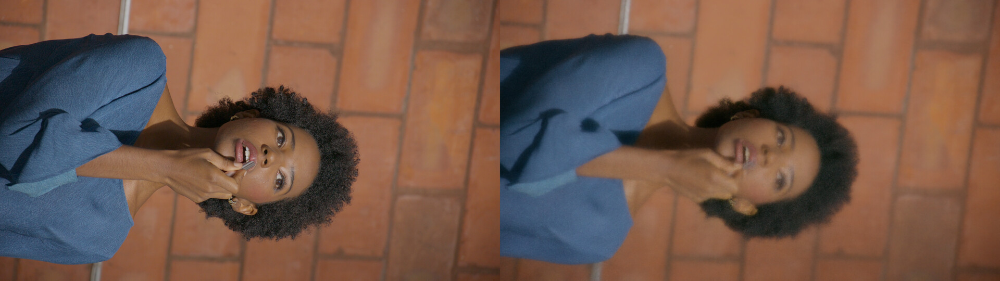
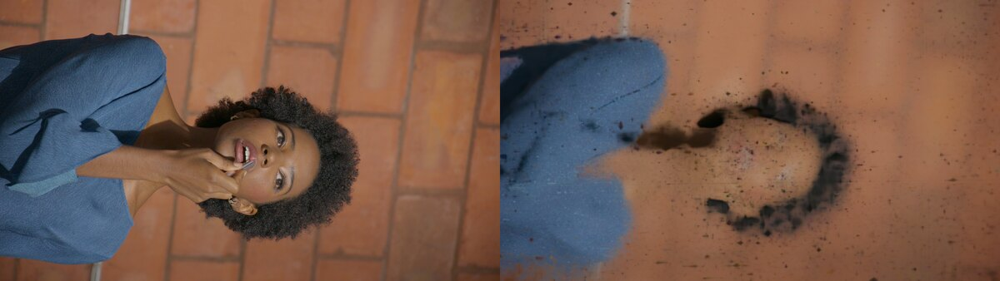
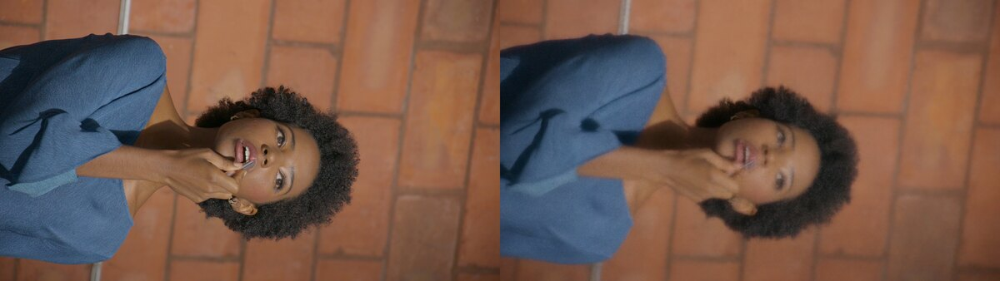
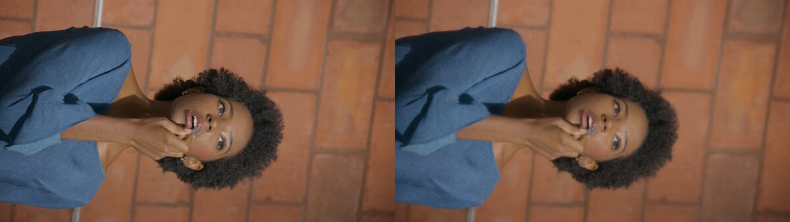
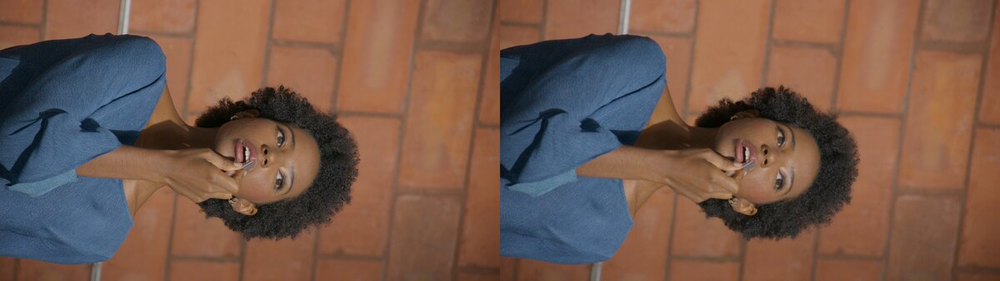

# DEC5 frame 000899: LookCloser blur causal debugging

## What was tested

- One temporal instant only (`000899`), display-referred 1920x1080 JPEGs, no masks.
- One diagnostic target view is duplicated byte-for-byte between train and eval. This is an
  overfit/capacity gate, not a held-out novel-view result.
- Four or eight nearest train cameras as identified per row, with no appearance embeddings, U-Net,
  LPIPS training objective, FAS, frequency grid, or feature re-weighting unless a row explicitly
  says otherwise.
- Scene coordinates use `focus/up/auto_scale_poses=True`, `scene_scale=1`, after the raw-coordinate
  control proved that a misplaced contraction centre was a major independent blur source.
- Fixed dense traversal with 1024, 2048, or 4096 samples/ray and 4096 train rays/update isolates
  the base radiance field from occupancy and adaptive traversal.

## Results

| Configuration | Step | PSNR | SSIM | LPIPS | Visual result |
|---|---:|---:|---:|---:|---|
| Base field, historical raw SH directions | 16k | 31.6134 | 0.854739 | 0.236166 | strong face/background blur |
| Base field, TCNN SH directions remapped to `[0,1]` | 20k | 31.5705 | 0.854414 | 0.229824 | detail improves, blur remains |
| Same continuation | 24k | 31.5068 | 0.853820 | 0.228220 | PSNR/SSIM plateau/regress; still visibly blurred |
| `softplus`, density bias `-2`, random background | 8k | 28.5839 | 0.830477 | 0.391645 | broad translucent volume and doubled features |
| `trunc_exp`, density bias `-2`, random background | 8k | 25.0935 | 0.786294 | 0.650897 | severe sparse ghosting; rejected |
| Eight cameras, fixed 1024, `softplus(+1)`, scratch | 8k | 31.1551 | 0.841111 | 0.309446 | blurred; about two ray observations/pixel |
| Same eight-camera run | 16k | 31.3373 | 0.843983 | 0.259122 | LPIPS improves, SSIM `+0.00287`; visible blur remains |
| Eight cameras, fixed 2048, compute-matched | 4k | 33.6855 | 0.870598 | 0.292992 | `+2.53` dB vs fixed-1024/8k at equal field queries |
| Same fixed-2048 run | 8k | 34.0968 | 0.880712 | 0.241599 | clearer face/hair/background; convergence remains active |
| Eight cameras, fixed 4096, compute-matched | 2k | 34.1867 | 0.872627 | 0.333713 | best PSNR at equal point-query budget, but too few image rays for perceptual quality |
| Same fixed-4096 run | 4k | 34.8544 | 0.888765 | 0.274319 | visibly sharper face, ear, hair and brick seams |
| Same fixed-4096 continuation | 6k | 35.3406 | 0.898659 | 0.235223 | all three metrics still improve materially |
| Same fixed-4096 continuation | 8k | 35.7785 | 0.905970 | 0.207861 | first diagnostic result below the `0.21` LPIPS target |
| Same fixed-4096 continuation | 10k | **35.9629** | **0.910975** | **0.189542** | acceptable residual blur; stopped at the requested SSIM plateau boundary |

The 24k evaluator render is shown below (GT left, prediction right):

The matched `trunc_exp(-2)` activation test failed visually as well as numerically (GT left,
prediction right):

Doubling the camera count did not itself remove the blur at step 16000 (GT left, prediction right):

At the same cumulative field-query budget, doubling along-ray samples makes the prediction
substantially sharper (GT left, prediction right):

Resolving roughly two finest hash-grid cells per ray interval removes most of the remaining
diagnostic blur (GT left, prediction right):

Full artifacts:

- Run: `/home/brans/lookcloser_temp/lookcloser_runs/dec5_000899_sh_direction_contract_causal/lookcloser/camera4_focus_scene1_fixed1024_densityp1_uniform4096_nofreq_shfix_s42_16k_to24k_retry`
- Render: `renders_best_step-000024000/eval_img_0000.png`
- Metrics: `eval_best_step-000024000.json`

## Insights

1. The LookCloser color field violated tiny-cuda-nn's SphericalHarmonics input contract in both
   dense and packed query paths. Nerfstudio rays are in `[-1,1]`; TCNN SH expects `[0,1]`.
   Centralizing `(direction + 1) / 2` is a required correctness fix, but the measured A/B shows it
   is not the whole blur cause.
2. Disabling every frequency component did not remove blur. Frequency-map quality is therefore not
   the first remaining bottleneck.
3. The `+1` pre-softplus density run produces accumulation/depth images that visibly follow image
   texture and broad object interiors instead of a clean thin surface. This supports a coloured
   volumetric-fog solution.
4. Fixed dense rendering accepted `background_color=last_sample` but silently treated it as black.
   The shared residual-transmittance helper was initially connected only to the adaptive dense
   path; an integration test exposed that the separate fixed path still drifted. Both dense paths
   now route through the same helper. Consequently the earlier `density_bias=-4/last_sample`
   result is invalid as an A/B and is not used as evidence.
5. Camera-ladder datasets now preserve an optional `sparse_pc.ply`; dropping it previously changed
   sparse geometry/depth initialization together with camera count and invalidated causal ladders.
6. Merely switching from `softplus` to the Instant-NGP/Nerfacto `trunc_exp` activation is not the
   cure. At the same `-2` bias and random-background pressure it widened the train/eval gap and
   produced point-like view-specific ghosts. Activation remains explicit for controlled studies,
   while the camera ladder retains the last acceptable `softplus(+1)` base.
7. Eight-camera scratch training improves LPIPS substantially between 8k and 16k, but PSNR adds
   only `0.1822` dB and SSIM only `0.00287`. The face, ear, hair and brick seams remain visibly
   smoothed. More cameras are therefore not a causal fix, and this fixed-1024 branch should not be
   extrapolated to a long run without testing the ray interval.
8. The local paper explicitly predicts this failure mode: sampling points too far from a
   high-frequency surface yield incorrect colours and blur. Across a normalized AABB, fixed 1024
   samples are roughly an order of magnitude coarser than the finest 8192-resolution hash cells.
   The next experiment doubles samples/ray while matching total field queries against fixed-1024
   step 16000.
9. The exact flattened evaluator path confirms the AABB itself is healthy: all `2,073,600` target
   rays intersect `[-1,1]^3`, with ray spans tightly distributed from `1.9976` to `2.0271` scene
   units. Fixed 1024 therefore advances about `0.00196` scene units per sample, or roughly eight
   cells of the finest 8192-resolution hash level. Fixed 2048 still advances four finest cells.
10. The compute-matched result confirms along-ray undersampling causally. Fixed-2048/4k uses the
    same `33.56` billion point queries as fixed-1024/8k but improves PSNR by `2.5304` dB and SSIM
    by `0.02949`, despite seeing half as many image rays. At `8k`, fixed 2048 improves further by
    `0.4113` dB, `0.01011` SSIM and `0.05146` LPIPS, so it is not yet converged.
11. Fixed 4096 confirms the same mechanism rather than a lucky 2048 setting. At equal cumulative
    field queries, fixed-4096/2k beats fixed-2048/4k by `0.5012` dB PSNR, although LPIPS is worse
    because it has seen half as many image rays. Once image-ray exposure catches up, fixed-4096/8k
    beats fixed-2048/8k by `1.6817` dB, `0.02526` SSIM and `0.03374` LPIPS.
12. From fixed-4096 step 8k to 10k, PSNR still rises `0.1844` dB and LPIPS falls `0.01832`, but
    SSIM rises only `0.005005`. This is the user-defined plateau boundary, so the diagnostic branch
    stops at 10k rather than spending another interval on a duplicated train/eval view.
13. This result does not yet establish novel-view quality. The next dataset is constructed
    immutably from a physical held-out camera plus its 16 nearest train cameras; other filename-eval
    cameras are excluded from training, masks are rejected, and the optional sparse PLY is retained.

Next gate: measure fixed-4096 on the physical held-out view with 16 nearest train cameras, increasing
iterations only while all-image PSNR and perceptual/structural metrics continue to improve. After
that base-field gate, test whether the paper's frequency-guided adaptive marcher can recover the
same interval resolution with fewer samples; feature re-weighting and FAS remain off for that A/B.

Subsequent held-out geometry work completed this gate and supersedes the earlier
sampling-only hypothesis. A continuous fused actor surface plus calibrated train-image
reprojection reduces held-out face LPIPS from `0.306217` to `0.173967`, while the same
nearest image without the surface warp scores `0.558107`. Thus dense along-ray sampling
is necessary for the duplicated-train-view overfit test, but the physical held-out blur
persists because the volumetric/shared RGB representation averages competing camera
observations. The implemented optional final path and complete A/B are documented in
[`dec5_000899_surface_light_field.md`](dec5_000899_surface_light_field.md).

## Runs With Artifact ROI And Runtime Metrics

| Timestamp | Selection | Train Seconds | Eval Seconds | Artifact Seconds | Total Seconds | Artifact Score | Serious Artifact Score | ROI Artifact Score | ROI Serious Score | ROI Serious Count | Stand Connector | Params | Checkpoint | PSNR | SSIM | LPIPS | Eval JSON | Renders |
|---|---|---:|---:|---:|---:|---:|---:|---:|---:|---:|---:|---|---|---:|---:|---:|---|---|
| camera16_depthAABB_fullray64_guided64w03_LOS001_decay6to8_dist002_nofreq_noFAS_s42_to8k | best_psnr15.242_lpips_tiebreak_step_2000 | 271.492 | 11.804200 | 0.000000 | 284.602 | n/a | n/a | n/a | n/a | n/a | n/a | `{"adaptive_coarse_step_size": null, "adaptive_fixed_fallback_samples_per_ray": 0, "adaptive_interval_level_mode": "midpoint", "adaptive_max_frequency_level": null, "adaptive_max_step_size": 0.1, "adaptive_min_frequency_level": 0.0, "adaptive_min_step_size": 0.0001, "adaptive_warmup_steps": 4096, "alpha_thre": 0.0, "appearance_embedding_dim": 0, "artifact_crop_bottom": 0, "artifact_crop_left": 0, "artifact_crop_right": 0, "artifact_crop_top": 0, "artifact_detector_preset": "legacy", "artifact_render_names": ["eval_img_0000.png"], "artifact_roi_crop_names": ["left_stand_connector_eval0", "left_stand_eval0", "left_hand_background_eval0", "left_hand_outlet_stand_eval0", "floor_crack_eval0", "fingers_right_tight_eval1", "stand_label_eval2", "tangled_cable_eval2", "fingers_center_eval2"], "artifact_roi_drop_border_components": 0, "artifact_roi_score": false, "auto_scene_box_metadata": null, "auto_scene_scale_from_points": false, "auto_scene_scale_metadata": null, "background_color": "black", "cache_train_rays": false, "cache_train_rays_chunk_size": 1048576, "camera_optimizer_lr": 0.001, "camera_optimizer_mode": "off", "center_method": "focus", "checkpoint_load_mode": "resume", "color_num_layers": 2, "cone_angle": 0.0, "corrected_arm_allocator": false, "density_activation": "softplus", "density_bias": -4.0, "depth_unit_scale_factor": 1.0, "depth_unit_scale_factor_source": "transforms.json:rendered_depth_teacher", "eag_dssim_weight": 0.2, "eag_edge_weight": 0.0, "eag_lpips_weight": 0.0, "eag_patch_size": 11, "early_reject_lpips_above": null, "early_reject_psnr_below": null, "early_reject_ssim_below": null, "enable_adaptive_ray_marching": true, "enable_fas": false, "enable_feature_reweighting": false, "enable_frequency_grid": false, "eval_num_rays_per_batch": 4096, "eval_num_rays_per_chunk": 2048, "fallback_frequency_level": 0.0, "far_plane": 1000.0, "fas_consolidate_h2d": false, "fas_decay_start_steps": -1, "fas_decay_steps": 0, "fas_level_count_alpha": 0.0, "fas_max_sampling_level": -1, "fas_patch_group_size": 1, "fas_ramp_steps": 0, "fas_strength": 1.0, "fas_warmup_steps": 0, "feature_reweighting_after_switch": null, "feature_reweighting_strength": 1.0, "feature_reweighting_switch_step": null, "fields_lr": null, "fields_lr_final": null, "fields_scheduler_max_steps": null, "fixed_num_samples_per_ray": 256, "frequency_map_dir": "lookcloser_frequencies", "fused_adam": false, "fused_adam_switch_step": null, "geo_num_layers": 1, "geometry_support_batch_size": 8192, "geometry_support_decay": 0.95, "geometry_support_dilation_radius": 1, "geometry_support_dilation_shape": "cube", "geometry_support_map_dir": null, "geometry_support_map_suffix": ".pt", "geometry_support_min_accumulation": 0.1, "geometry_support_min_peak_weight": 0.002, "geometry_support_occupancy_mode": "union", "geometry_support_probe_samples": 1024, "geometry_support_quantile": 0.8, "geometry_support_threshold": 0.2, "geometry_support_update_interval": 1024, "grad_scaler_growth_interval": null, "grad_scaler_init_scale": null, "grid_resolution": 128, "grid_update_batch_size": 2048, "grid_update_interval": 1024, "hdr_initial_radiance": "auto", "hdr_linear_scale": "auto", "hdr_softplus_beta": 1.0, "huber_delta": 0.1, "initialize_frequency_grid_from_sparse": false, "load_optimizers": true, "load_scheduler": true, "max_num_iterations": 8000, "max_res": 8192.0, "max_res_base": 2048.0, "max_steps_per_ray": 1024, "min_res": 16.0, "near_plane": 0.01, "num_frequency_levels": 16, "occupancy_binary_warmup_steps": 4096, "occupancy_dilation_radius": 0, "occupancy_ema_decay": 0.95, "occupancy_eval_dilation_frequency_halo": 0, "occupancy_eval_dilation_frequency_quantile": null, "occupancy_eval_dilation_min_frequency_level": 0.0, "occupancy_eval_dilation_radius": 0, "occupancy_fixed_fallback_samples_per_ray": 0, "occupancy_grid_levels": 1, "occupancy_occ_thre": 0.01, "occupancy_thre_clamp_mult": 1.0, "occupancy_update_interval": 16, "occupancy_update_step_size": null, "occupancy_warmup_steps": 4096, "optimizer_max_norm": null, "optimizer_max_value": null, "orientation_method": "up", "pq_black_nits": 0.005, "pq_code_temperature": 1.0, "pq_linear_anchor_weight": 0.0, "pq_nits_per_scene_unit": "auto", "pq_peak_nits": 10000.0, "preserve_best_eval_model_checkpoint": true, "priority_regions_path": "", "priority_sampling_fraction": 0.0, "rawnerf_epsilon": 0.001, "rawnerf_grad_clip": 0.1, "ray_sampling_mode": "auto", "reconstruction_loss_type": "charbonnier", "render_step_size": null, "render_step_size_mult": 1.0, "replay_eval_trajectory": false, "resume_fields_lr_override": null, "rgb_output_parameterization": "sigmoid", "sampling_ramp_end": 3.0, "sampling_ramp_start": 1.0, "save_only_latest_checkpoint": null, "scale_factor": 1.0, "scene_box_center": [-0.188377, 0.48837, 0.013649], "scene_box_half_extent": [0.34956, 0.589312, 0.490045], "scene_box_source": "cli", "scene_scale": 2.0, "scene_scale_margin": 1.5, "scene_scale_quantile": 0.995, "scene_scaled_max_res": false, "seed": 42, "stable_occupancy_reduction": true, "step_interval": 2000, "stop_at_cumulative_point_samples": null, "target_num_samples_after_switch": null, "target_num_samples_per_batch": 0, "target_num_samples_switch_step": null, "tcnn_network_jit": false, "tcnn_network_jit_scope": "both", "tcnn_network_jit_second_switch_scope": null, "tcnn_network_jit_second_switch_step": null, "tcnn_network_jit_switch_step": null, "train_num_rays_per_batch": 4096, "train_rays_after_switch": null, "train_rays_switch_step": null, "training_patch_size": 1, "transmittance_threshold": 0.0, "use_gradient_scaling": false}` | `/dev/shm/lookcloser_runs/dec5_000899_lookcloser_geometry_bootstrap/lookcloser/camera16_depthAABB_fullray64_guided64w03_LOS001_decay6to8_dist002_nofreq_noFAS_s42_to8k/nerfstudio_models/step-000002000.ckpt` | 15.242383 | 0.701576 | 0.849040 | `/dev/shm/lookcloser_runs/dec5_000899_lookcloser_geometry_bootstrap/lookcloser/camera16_depthAABB_fullray64_guided64w03_LOS001_decay6to8_dist002_nofreq_noFAS_s42_to8k/eval_best_step-000002000.json` | `/dev/shm/lookcloser_runs/dec5_000899_lookcloser_geometry_bootstrap/lookcloser/camera16_depthAABB_fullray64_guided64w03_LOS001_decay6to8_dist002_nofreq_noFAS_s42_to8k/renders_best_step-000002000` |
