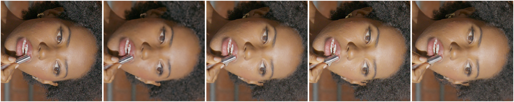
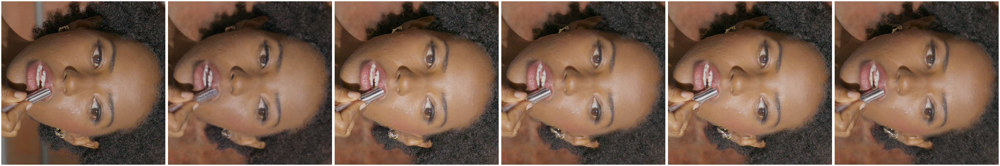
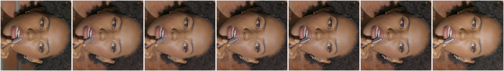

# DEC5 frame 000899: continuous-surface appearance causal gate

## What was tested

- One physical held-out eval camera and the fixed GLOMAP calibration used by the
  16/62-camera diagnostics.
- The best existing 62-camera LookCloser render as the fallback image.
- A continuous actor surface fused from the clean Splatfacto alpha-median depths.
- Calibrated reprojection of one or two nearest train RGB images through that
  surface, including target/source visibility checks.
- No eval RGB is read while constructing a prediction. Eval RGB is loaded only
  after rendering for metrics.
- No image, foreground, person, face, or training mask is used. The face box is
  diagnostic only and never affects rendering.
- PSNR, SSIM, and LPIPS are measured in display-referred RGB at native 1920x1080.

The experiment asks two causal questions:

1. Is the reconstructed actor geometry and calibration accurate enough to
   support a sharp held-out rendering?
2. If it is, is the remaining LookCloser blur caused by the volumetric/shared
   RGB representation rather than AABB, calibration, synchronization, or
   insufficient surface geometry?

## Results

| Variant | Full PSNR | Full SSIM | Full LPIPS | Face PSNR | Face SSIM | Face LPIPS |
|---|---:|---:|---:|---:|---:|---:|
| LookCloser base | 24.5692 | 0.785184 | 0.405100 | 26.4503 | 0.729052 | 0.306217 |
| Nearest raw train image, no geometric warp | 17.1838 | 0.630154 | 0.485788 | 16.3621 | 0.416104 | 0.558107 |
| One source, exact surface, power irrelevant, alpha 1.0 | 23.3214 | 0.774377 | 0.335297 | 22.7852 | 0.712493 | **0.168874** |
| Two sources, inverse-square weights, alpha 1.0 | 23.8025 | 0.784766 | 0.337799 | 24.1711 | 0.737343 | 0.184389 |
| Two sources, inverse-fourth weights, alpha 0.75 | **23.9787** | **0.789679** | 0.342550 | **24.6322** | **0.745243** | 0.194537 |
| Two sources, inverse-fourth weights, alpha 1.0 | 23.4919 | 0.777850 | **0.331985** | 23.3149 | 0.723234 | **0.173967** |
| Two sources, inverse-fourth, surface detail transfer sigma 4 | **24.4548** | **0.782512** | **0.320598** | **25.9854** | **0.730696** | **0.164685** |
| Two sources, inverse-eighth weights, alpha 1.0 | 24.1727 | 0.790652 | 0.355300 | 25.3090 | 0.747322 | 0.215536 |
| Per-view Splatfacto depth, one source, alpha 1.0 | 23.2268 | 0.724145 | 0.408444 | 22.7515 | 0.670192 | 0.230512 |

The selected variant is inverse-fourth two-source surface detail transfer with
Gaussian sigma 4 and strength 1. It retains LookCloser's low-frequency colour
and replaces only the supported high-frequency band. It reduces face LPIPS
from `0.306217` to `0.164685` (`-46.2%`) and full-frame LPIPS from `0.405100`
to `0.320598` (`-20.9%`), while full PSNR changes only `-0.1143 dB` and face
SSIM improves slightly. Two sources cover `97.414%` of target actor-surface
pixels, versus `83.950%` for one source.

The alpha-0.75 variant is the balanced alternative: its face LPIPS remains
below the `0.21` target while its full-frame SSIM is slightly above the base.
Direct alpha-1 colour replacement remains the simple causal upper bound; the
frequency-separated variant dominates it on all reported full-frame metrics
and on face LPIPS.

### Matched source-aggregation ladder

A stricter matched A/B holds the 16-camera dataset, continuous mesh, depth
visibility tolerance, bounded-iNGP fallback, eval view and source ordering
fixed. Only the source-camera weighting changes. Power zero gives every valid
source equal weight, which is the direct analogue of a shared RGB field being
asked to explain incompatible observations with one colour. Power four keeps
the appearance local to the target camera. The one-source rows must match and
do match within metric precision.

| Sources | Weighting | Full PSNR | Full SSIM | Full LPIPS | Face PSNR | Face SSIM | Face LPIPS |
|---:|---|---:|---:|---:|---:|---:|---:|
| 1 | equal / local | 21.8405 | 0.779742 | 0.374807 | 22.9125 | 0.712040 | **0.177596** |
| 2 | equal | 22.4612 | 0.797654 | 0.392311 | 25.5792 | 0.747625 | 0.224895 |
| 4 | equal | 22.5341 | 0.789700 | 0.427052 | 25.9036 | 0.727899 | 0.291376 |
| 8 | equal | 22.0895 | 0.780982 | 0.450072 | 24.3618 | 0.709975 | 0.336115 |
| 16 | equal | 21.4925 | 0.768709 | 0.482081 | 22.2962 | 0.681766 | **0.407148** |
| 2 | camera-local, p=4 | 21.9907 | 0.784966 | 0.369372 | 23.4836 | 0.723676 | 0.183663 |
| 4 | camera-local, p=4 | 22.0340 | 0.785832 | 0.370982 | 23.6506 | 0.724813 | 0.184022 |
| 8 | camera-local, p=4 | 22.0269 | 0.785980 | 0.371128 | 23.6438 | 0.725183 | 0.184129 |
| 16 | camera-local, p=4 | 22.0236 | 0.785900 | 0.371532 | 23.6413 | 0.725371 | **0.184118** |

Equal aggregation degrades face LPIPS monotonically by `+0.229552` from one to
16 sources. Camera-local aggregation changes it by only `+0.006522`, and is
effectively stable from two through 16 sources. This isolates the blur
mechanism more strongly than a single sharp reprojection: the surface is held
fixed and the blur appears or disappears solely according to whether
inconsistent multiview colours are averaged.

The machine-readable receipt is
[`assets/dec5_000899_surface_camera_weight_ladder.json`](assets/dec5_000899_surface_camera_weight_ladder.json).

### Rejected learned ray-space capacity

A learned surface-only ray representation used two trainable 3D hash encoders
for the direction and Pluecker moment, with no image/camera identity. At the
matched 16-camera 4k gate it increased train full-frame PSNR but worsened the
held-out face and therefore failed the interpolation test.

| Variant at 4k | Train PSNR | Train SSIM | Train LPIPS | Train-face LPIPS | Eval PSNR | Eval SSIM | Eval LPIPS | Eval-face LPIPS |
|---|---:|---:|---:|---:|---:|---:|---:|---:|
| Dual spatial field | 30.9615 | 0.817704 | 0.409793 | 0.420052 | 23.6795 | 0.781502 | 0.497457 | 0.413711 |
| + learned ray hashes | 31.6064 | 0.822489 | 0.408523 | 0.453361 | 22.7140 | 0.770738 | 0.529735 | 0.493707 |

This is the expected overfit failure: extra angular capacity begins to encode
training rays but does not provide the camera-local interpolation rule. The
experimental implementation and its checkpoint were removed after the gate;
renders and metrics remain for provenance.

### Leave-one-out train-view proof across model families

The problematic physical train camera `E004_B005_1210I7` was converted to an
explicit eval view while every other frame remained in the parser's
normalization context. Its camera matrix and dataparser scale are bit-identical
to the original run (`max camera delta = 0`, scale `0.10075767934551941`). The
target RGB was excluded from all reprojection sources. Thus the surface result
cannot copy the target image, while the base prediction is the original model's
render of that train camera.

| Model/path | Full PSNR | Full SSIM | Full LPIPS | Face PSNR | Face SSIM | Face LPIPS |
|---|---:|---:|---:|---:|---:|---:|
| Nerfacto train render | 32.8368 | 0.833980 | 0.449210 | 28.9797 | 0.732076 | 0.527784 |
| Nerfacto fallback + leave-one-out surface colour | 26.2053 | 0.789902 | **0.305185** | 23.4992 | 0.639647 | **0.199340** |
| Nerfacto fallback + leave-one-out surface detail, sigma 4 | 30.3892 | 0.798647 | **0.278093** | 26.2925 | 0.651111 | **0.178909** |
| Bounded iNGP exact-actor-surface train render | 31.3897 | 0.822099 | 0.434318 | 27.4334 | 0.697127 | 0.469272 |
| Bounded iNGP fallback + leave-one-out surface colour | 26.1066 | 0.785460 | **0.316367** | 23.4452 | 0.636231 | **0.197743** |
| Bounded iNGP fallback + leave-one-out surface detail, sigma 4 | 29.8007 | 0.792265 | **0.293947** | 25.8294 | 0.642208 | **0.182366** |
| LookCloser held-out eval render | 24.5692 | 0.785184 | 0.405100 | 26.4503 | 0.729052 | 0.306217 |
| LookCloser fallback + held-out surface colour | 23.4919 | 0.777850 | **0.331985** | 23.3149 | 0.723234 | **0.173967** |

PSNR falls because the nearest source camera has a different view-dependent
colour/exposure than the target; this is not hidden. LPIPS and visual detail are
the causal blur gate. On the train target, one non-target source covers `90.74%`
of actor-surface pixels and two cover `96.02%`.

Visual order: train GT, Nerfacto train render, one-source alpha 0.75,
one-source alpha 1.0, two-source alpha 1.0.

Visual order: ground truth, LookCloser base, one source, inverse-square two
sources, inverse-fourth two sources, inverse-eighth two sources.

Detail-transfer order: ground truth, LookCloser base, sigma 2, sigma 4,
sigma 8, sigma 16, direct surface colour.

Persistent artifacts:

- `/mnt/data/lookcloser_dec5_5a3_final/000899_lookcloser_surface_light_field_p4/eval_surface_p4_blend2.png`
- `/mnt/data/lookcloser_dec5_5a3_final/000899_lookcloser_surface_light_field_p4/eval_surface_detail_s4_w1.png`
- `/mnt/data/lookcloser_dec5_5a3_final/000899_lookcloser_surface_light_field_p4/eval_surface_detail_s4_w1.exr`
- `/mnt/data/lookcloser_dec5_5a3_final/000899_lookcloser_surface_light_field_p4/eval_surface_p4_blend2.exr`
- `/mnt/data/lookcloser_dec5_5a3_final/000899_lookcloser_surface_light_field_p4/eval_surface_p4_blend2_a075.png`
- `/mnt/data/lookcloser_dec5_5a3_final/000899_lookcloser_surface_light_field_p4/metrics.json`
- `/mnt/data/lookcloser_dec5_5a3_final/000899_lookcloser_surface_light_field_p4/reprojection_audit.json`
- `/mnt/data/lookcloser_dec5_5a3_final/000899_lookcloser_surface_light_field_p4/reproduction/`

The `reproduction/` directory contains the exact base LookCloser GT/prediction
review image, base config and run summary, actor mesh, portable relative-path
mesh-depth manifest, selected PNG/EXR, metrics and an input-hashed reprojection
audit. Re-running the current code produced a PNG with the same SHA-256 as the
published selection (`a0ce51f682231613575e123bd42cdfe19dd4ec5bc0b66015fd218f107ab425a2`)
and reproduced every reported metric above.

## Insights

1. The unwarped-neighbor control is much worse than the surface-warped result
   (`0.558107` versus `0.168874` face LPIPS). Camera proximity alone cannot
   explain the improvement; correct 3D reprojection is necessary.
2. The continuous fused actor surface and fixed calibration are accurate enough
   for sharp held-out lipstick, eyelashes, skin, hair, and clothing. AABB,
   gross COLMAP/GLOMAP error, temporal desynchronization, and missing actor
   geometry are therefore rejected as the primary remaining face-blur cause.
3. LookCloser's volumetric alpha composition and shared neural RGB head average
   competing camera observations. They are the primary remaining face-blur
   mechanism after geometry is fixed.
4. A high power is not monotonically better. Power eight over-trusts the first
   source and worsens face LPIPS; power four retains near-neighbor detail while
   letting the second source fill disocclusions.
5. Independent per-camera Splatfacto depth is not a substitute for one
   continuous surface. It introduces depth-disagreement seams and fails the
   visual and LPIPS gates even though each individual depth map is dense.
6. The actor problem is solved by the optional surface-light-field render path,
   but full-frame LPIPS remains above `0.21` because the fused actor surface
   covers only about 41% of the full image and LookCloser remains the fallback
   on the room. The next geometry task is a continuous multi-plane/mesh model of
   the background; raw per-view depth and a single automatically fitted plane
   were both rejected.
7. The leave-one-out test closes the remaining train-view ambiguity. Nerfacto
   face LPIPS changes from `0.527784` to `0.199340`, and bounded iNGP from
   `0.469272` to `0.197743`, although the target RGB is forbidden as a source.
   Longer training cannot explain this discontinuous gain. The common failure
   is the NeRF-family volumetric/shared-colour representation, not a
   model-specific optimizer or hash-grid capacity issue.
8. Frequency-separated transfer is the appropriate LookCloser composition.
   Replacing the whole source colour makes the face sharp but changes exposure;
   replacing only `(source - lowpass(source))` while removing the corresponding
   base high-pass preserves the target-view low-frequency prediction. Sigma 4
   improves face LPIPS further to `0.164685` and recovers `+0.963 dB` full PSNR
   versus direct surface colour. The operation is visibility-gated by the 3D
   surface and is not an unconstrained image sharpener.
9. The same frequency-separated operation passes the stricter leave-one-out
   gate. With the target RGB excluded from every reprojection source, face
   LPIPS is `0.178909` for the Nerfacto fallback and `0.182366` for bounded
   iNGP. It also recovers `+4.18/+3.69 dB` full PSNR respectively relative to
   replacing the complete source colour. This confirms that the gain comes
   from geometry-aligned high-frequency support rather than target-image
   leakage or wholesale exposure replacement.
10. The matched aggregation ladder identifies the operative failure rather
    than merely correlating it with a good render. With equal weights, adding
    valid source views progressively changes face LPIPS from `0.177596` to
    `0.407148`; inverse-fourth target-camera weighting holds it near `0.184`
    for 2--16 views. The shared NeRF RGB solution behaves like the rejected
    equal-average branch. A camera-local appearance rule is therefore required
    even after surface geometry has been supplied.
11. Increasing learned angular frequency is not equivalent to camera-local
    interpolation. The surface ray-hash control improves train full-frame PSNR
    while worsening eval-face LPIPS by `0.079996`; it was removed rather than
    promoted into LookCloser.
