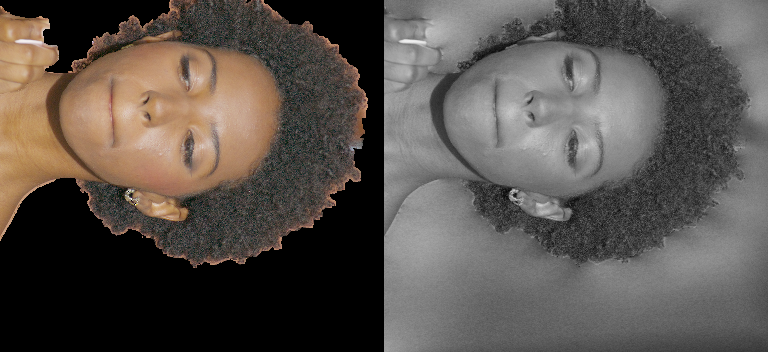
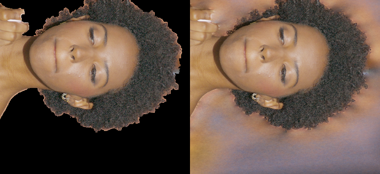

# DEC5 lipstick girl: кандидаты для проверки LookCloser

## Что сохранено и зачем

2026-09-29. Ветка `look_closer_on_lipstick_girl_candidate` создана от `630d58bd`
(подготовка mesh-distillation), отдельно от поздней экспериментальной истории.
Это набор кандидатов для последовательных ablation-тестов, **не готовое улучшение
для main**. Перенесены LookCloser field/model, отдельный distillation pipeline,
подготовка данных/частот, диагностический runner и необходимые компоненты/тесты.
Gaussian/NHT trainers, перенос фотографий в итоговый RGB и локальные исправления
щёк/пальца не добавлены. Старые mesh/texture инструменты, уже бывшие в базе,
не удалялись и не являются улучшениями LookCloser.

Архитектурный источник — локальный [Paper LookCloser.md](../Paper%20LookCloser.md),
§4.2 и Training Loss: Frequency Grid, re-weighting, FAS, ARM, Charbonnier RGB,
distortion и ранняя depth supervision. Fixed sampling, нормированная exponential
density и matte/background objectives ниже — экспериментальные расширения,
а не подтверждённые предписания статьи. Обычные method configs не заменены.

## Был ли LookCloser_vs_G0.mp4 сравнением с лучшим LookCloser?

**Нет: лучшим среди всех сохранённых чистых LookCloser он не был подтверждён.**
LookCloser-сторона взята из
`dec5_core_retraining/selected_field_native_review/full_scene.mp4`, поле —
`native_pose_uncertain_hull/best.pt`, выбранный шаг **37000**.
Это победитель внутри одного этапа с native RGB, pose refinement и uncertain
matte/hull, а не результат сравнения всех предыдущих и последующих полей.
[Исходная квитанция](assets/lipstick_lookcloser_candidates/final_review.json)
прямо фиксирует `accepted_as_artifact_free_fix: false`.
Она описывает исторический pure/hybrid обзор; её `comparison_video` не следует
путать с позднее собранным `LookCloser_vs_G0.mp4`.

У этого поля native face: **31.250 / .8997 / .1852** (PSNR / SSIM / LPIPS).
Ранее сохранённый `recovery_v3/actor_tube_rgb/best.pt`, шаг 22000, имел
**33.940 / .9233 / .1148** на native face по историческому отчёту.
Позднее чистый LookCloser с наблюдаемым фоном доходил до
**32.962 / .9158 / .1691** (выбранный 70000).
Эти ROI-результаты не задают общего победителя по волосам и всему видео, но
опровергают представление о 37000 как о всесторонне лучшем чистом LookCloser.
Плохие щёки и волосы в сравнении не доказывают предел качества метода.

Резкость старого `comparison.mp4` с проецируемыми фотографиями нельзя записывать
в улучшения обученного LookCloser: часть текстуры там поступала прямо из камер.
На новом сравнении нужно отдельно подписывать learned RGB и photo transfer.

## Раннее устранение сильного размытия

Самое сильное сохранённое свидетельство — смена **параметризации плотности**
на одном синтетическом обучающем ракурсе `train_0033.png` сцены `000973`.
Оба прогона: corrected SH, fixed 128 samples, 2048 rays, hash 19,
LR .01→.001, одинаковый manifest данных; сравниваем один шаг 2000.

| Density, step 2000 | Train PSNR ↑ | SSIM ↑ | LPIPS ↓ | Средний PSNR двух synthetic eval |
|---|---:|---:|---:|---:|
| `softplus(logit + 1)` | 20.2118 | .934591 | .232577 | 17.6148 |
| Нормированная exponential | **37.5926** | **.986615** | **.009962** | 20.6891 |

Метрики: stride 2, masked teacher ROI; не полнокадровая оценка 62 реальных камер.
[Softplus request](assets/lipstick_lookcloser_candidates/softplus_request.json),
[метрики](assets/lipstick_lookcloser_candidates/softplus_metrics.json);
[exponential request](assets/lipstick_lookcloser_candidates/normalized_exp_request.json),
[метрики](assets/lipstick_lookcloser_candidates/normalized_exp_metrics.json).
Скрипты имели разные SHA; bitwise-равенство начальных весов и RNG не установлено.
Это сильный кандидат, но ещё не изолированная причинная ablation.

Слева в каждой паре teacher, справа обученный RGB; ориентация исходных кропов сохранена:





Проверка изображений подтверждает исчезновение серого, малоконтрастного лица.
Новый ракурс остаётся существенно хуже train: выучить один кадр не значит
исправить многокамерную геометрию или волосы.

### Что именно здесь изменилось

В `LookCloserField.activate_density` сохранён opt-in bundle:

```python
sigma = trunc_exp(logits.float().clamp(-16., 11.) + 1.) / max_aabb_side
```

Плотность имеет размерность обратной длины. При малом нормированном AABB
softplus и прежний масштаб дают другую optical thickness и динамику обучения.
Деление на размер AABB обеспечивает инвариантность optical thickness при
совместном масштабировании геометрии. Однако эксперимент **не разделяет**
exponential, нормировку, clipping и FP32 — это главная первая задача новой сессии.

**FP32 — отдельное исправление численной корректности.** В позднем сохранённом
checkpoint конечные FP16 logits до 10.703 давали бесконечную exponential density
при evaluation. Явный float32 перед exponentiation нужен и вне autocast.
Тест проверяет конечность и масштабную инвариантность. Это не доказательство,
что перевод всей сети в FP32 сам по себе устранил ранний blur.

**Другой RGB objective не доказан причиной скачка.** Оба этих опыта использовали
weighted Charbonnier. Сам Charbonnier предусмотрен локальной статьёй; сравнение
MSE/Charbonnier нужно проводить отдельно при одинаковых остальных условиях.
Поздний underflow в custom Gaussian+LookCloser RGB trainer относится к другому
training loop. Его выводы и большие коэффициенты gradient scaling нельзя
автоматически переносить на стандартный Nerfstudio AMP. Тот trainer сюда не включён.

## Остальные кандидаты и границы доказательств

| Кандидат | Измеренное свидетельство | Статус для будущей проверки |
|---|---|---|
| Правильный диапазон SH | TCNN ожидает [0,1], старый код передавал [-1,1]. Legacy/corrected softplus: synthetic eval 17.606/.7009/.4926 → 17.615/.7005/.4935 | Исправление контракта, **само blur не устранило**; флаг сохраняет legacy контроль |
| Правильный gauge и плотность samples | На другом времени `000899` fixed1024/16k: 31.337/.8440/.2591; fixed4096/10k: 35.963/.9110/.1895 | Полезный ранний диагностический след; train/eval дублировали кадр, бюджеты разные, FAS выключен. Не доказательство novel-view улучшения `000973` |
| Tight AABB, conservative support, known-empty | Native face real-only 34.121/.9208/.1661 → tight empty-band 34.144/.9244/.1451 | Умеренное улучшение; support не должен обрезать волосы/предмет. Unknown ≠ empty |
| Mask/confidence-aware FAS и Frequency Grid | Unknown pixels исключены из целевых сигналов; неизвестные voxels не теряют capacity; масштаб глубины проверен | Исправления контрактов; отдельного causal выигрыша по RGB нет |
| Frequency projection после camera optimization | Частоты проецируются по исправленным training rays, а не старым poses | Исправление несогласованности координат; ablation качества ещё нужна |
| Более полный fit частот: 200→1000 updates/level | Доля максимальных 2D labels 30.82%→6.31%; 2D fit 40.434/.98897/.01091 | Улучшение preprocessing; не доказано улучшение 3D. Fresh hash23 вариант не прошёл visual gate |
| Mesh pretrain → real, сохранение Frequency Grid | Real-only6k face 34.067/.9343/.0573; 8-view pretrain→real8k 34.195/.9348/.0612, stride2 | Эффект малый и смешанный, бюджеты разные. Полный 300-view pretrain **не запускался** |
| Native 4K RGB, снижение доверия fractional matte | Full-confidence40k face 30.440/.8994/.0825 → confidence.1 31.146/.9094/.0716, stride2; совместно с hull ниже opaque deficit | Кандидат на уменьшение конфликтующих targets; native/pose/hull не считать одной доказанной причиной. Волосы оставались мягкими |
| Наблюдаемый фон вместо ошибочного extracted foreground | Paired68k native face 32.383/.9134/.1763 → 32.758/.9156/.1721; train boundary PSNR E/C 29.000→31.024, F/C 27.380→30.195 | **Положительный кандидат** там, где есть независимый фон; правый край волос покрыт недостаточно, артефакты не устранены |

Историческая проверка `000899` использовала другой нормализованный gauge.
Нельзя просто применить `focus/up/auto_scale` к текущим teacher depth/mesh:
вся геометрия, камеры, bounds и глубина должны преобразовываться согласованно.
Текущий distillation parser намеренно сохраняет уже подготовленный gauge.
[1024 samples](assets/lipstick_lookcloser_candidates/dec5_000899_camera8_fixed1024_step16000_gt_pred.jpg),
[4096 samples](assets/lipstick_lookcloser_candidates/dec5_000899_camera8_fixed4096_step10000_gt_pred.jpg).
Исторические альтернативные flags другого diagnostic checkout не объявляются
портированными: здесь сохранены выводы/настройки, а рабочий runner использует
текущие field и fixed/adaptive режимы.

Person masks действительно исключали часть помады, и support в её кончике был 0.
Ручная train-разметка предмета дала исправленные данные, но это не универсальное
решение: **код локальной цилиндрической mask repair сюда не добавлен**.
Сохранён общий контракт: foreground включает удерживаемые предметы, неизвестные
пиксели не считаются фоном, указанный новый support не заменяется старым из checkpoint.
В `actor_tube_rgb` эта исправленная разметка — confound, который нужно явно учитывать.

### Что не считать найденным решением

| Контроль | Результат |
|---|---|
| Увеличить matte coefficient .1→1 | Face stride2 30.692/.9054/.0680 → 28.487/.8763/.0921; ухудшение лица ради частичной непрозрачности |
| Native RGB patches + SSIM | Face native 31.817/.9043/.1804 → 31.836/.9056/.1854: смешанный результат, волосы/щёки не исправлены |
| Больше training depth samples 256+256→1024+256 | Face 31.809/.9043/.1782 → 31.861/.9041/.1771; hair LPIPS .7678→.7660, без заметного устранения дефектов |
| Больше rays 4096→16384 | Face 33.136/.9161/.1652 → 33.211/.9163/.1640; волосы практически прежние |
| Opacity-neutral distortion | Face 33.1565/.91610/.16492 → 33.1661/.91611/.16494; визуального исправления нет |
| Uniform learned mattes вместо legacy targets | Face 31.882/.9033/.1723 → 32.810/.9136/.1795; lipstick 27.037/.9395/.0219 → 22.060/.9021/.0698. Меньше дыр, но больше ложного foreground и темнее полоса щеки; visual gate не пройден |
| Native observed-background вместо HD composite | Face 33.146/.91654/.16424 → 33.146/.91662/.16476; видимого исправления нет |
| Persistent teacher depth, большой hash, более плотный inference | Не дали общего visual выигрыша; teacher depth мог формировать плотную оболочку вместо волос |

Обратите внимание: observed-background опыты продолжались на `learned_matte_data`,
чьи targets сами не прошли visual gate. Их paired выигрыш не означает, что этот
датасет следует без проверки взять за финальную основу. Общий pipeline сохранён;
отвергнутые matting-model генераторы и локальная tube repair не портировались.

Эти переключатели сохранены как **выключенные по умолчанию диагностические
контроли**, поскольку полезны для воспроизведения/исключения гипотез. Наличие
кода не означает рекомендацию его включить. Gaussian/NHT не являются результатами
улучшения чистого LookCloser и в перечень переносимых кандидатов не входят.

## Где код, рецепты и свидетельства

- [Field](../../nerfstudio/fields/lookcloser_field.py): SH, normalized FP32 density,
  conservative support; [model](../../nerfstudio/models/lookcloser.py): sampling,
  optical thickness, диагностические controls.
- [Pipeline](../../nerfstudio/pipelines/mesh_distillation_pipeline.py): фиксированный
  gauge, masked targets/FAS, Frequency Grid, camera-corrected projection,
  Charbonnier, FP32 optical-thickness BCE и early teacher depth.
- [Native targets](../../nerfstudio/model_components/native_training.py),
  [patches](../../nerfstudio/model_components/native_patches.py),
  [observed background](../../nerfstudio/model_components/observed_background.py):
  train-only supervision с совпадающими pixel centers и fallback при unknown.
- [Runner](../scripts/run_distillation_actor_probe.py),
  [подготовка](../scripts/prepare_distillation_actor_probe.py),
  [Frequency Grid initializer](../scripts/build_distillation_hybrid_frequency.py).
  В имени последнего `hybrid` означает real-photo frequencies + mesh geometry,
  не Gaussian и не подмену RGB при рендере.
- [Рецепты и проверенные внешние зависимости](../recipes/dec5_lookcloser_candidates.json).
  Код импортируется из этой ветки; данные/checkpoints остаются внешними.
- [SHA/provenance](assets/lipstick_lookcloser_candidates/provenance.json),
  [исторические отчёты: Git objects и SHA](assets/lipstick_lookcloser_candidates/historical_report_sources.json).
  Последние можно прочитать через `git show <git_object>` без data-drive snapshot.
- Raw paired evidence:
  [наблюдаемый фон](assets/lipstick_lookcloser_candidates/dec5_observed_background_training_results.json),
  [patches/samples](assets/lipstick_lookcloser_candidates/dec5_native_patch_supervision_results.json),
  [ray count](assets/lipstick_lookcloser_candidates/dec5_training_ray_coverage_results.json),
  [distortion](assets/lipstick_lookcloser_candidates/dec5_opacity_neutral_distortion_results.json),
  [native composition](assets/lipstick_lookcloser_candidates/dec5_native_composite_training_results.json).

## Следующая сессия: проверять по одному

1. Воспроизвести single-view collapse и normalized-density контроль: одинаковые
   данные/targets, initial weights, seed, batch order, sampling, шаги и eval domain.
   Рецепты ниже дают стартовые параметры, но текущий код не byte-identical старому.
2. Разделить density bundle: softplus/exp × без/с inverse-AABB scale; отдельно
   clipping и FP32 проверять на фиксированных logits/checkpoint. Не обучать
   заведомо переполняющийся FP16 вариант без finite/gradient gate.
3. Отдельно SH legacy/corrected; затем геометрический масштаб и fixed sample count,
   сначала с равными шагами, затем с равным compute. Не менять RGB objective вместе
   с плотностью. Для Charbonnier/MSE нужна отдельная явно записанная ablation.
4. На победившей корректной конфигурации: real-only62 против 8-view mesh pretrain
   с равным real/общим бюджетом; затем Frequency Grid init/update/freeze и 2D fit.
   Полный300-view pretrain имеет смысл только после этих controls.
5. Независимо native RGB, pose refinement, matte confidence, observed-background
   objective. Masks/support проверять на train-coverage волос и предметов;
   никаких правил по координатам щеки/пальца и post-render patches.
6. Для каждого допущенного кандидата сохранить native train/eval crops и одну
   неизменную camera path, особенно кадры18–23. Метрики PSNR/SSIM/LPIPS должны
   дополняться визуальной проверкой волос, щёк, большого пальца и временных скачков.
   Старый photo-transfer `comparison.mp4` — отдельный визуальный reference.
7. Перед переносом в main нужен paired full-frame all-eval отбор checkpoint:
   максимальный mean PSNR, LPIPS при разнице ≤.07dB, затем сохранённые рендеры.
   Дополнительно ROI и другая похожая сцена. Физический eval уже многократно
   использовался при разработке и не является untouched benchmark.

**Ограничение runner:** его исторический `eval_all_psnr` — среднее masked ROI
(для real данных обычно лицо), не full frame. `--eval-scale 2` — stride2,
`--eval-only` — native scale1. Эти числа нельзя смешивать. Runner оставлен для
диагностического воспроизведения; обязательный full-frame final gate ещё не
реализован этим runner. До такого gate кандидаты не объявляются validated.

`--load` восстанавливает field, Frequency Grid и Adam, затем задаёт новый LR schedule.
Это continuation, **не bitwise resume**: RNG/cache/scaler history полностью не
восстанавливается. Парные новые прогоны должны отдельно фиксировать начальные
состояния и последовательность лучей; сохранённые RNG в checkpoint полезны для аудита.

## Проверка этой ветки

44 целевых теста прошли (40 pipeline/data/field + 4 distortion controls), включая GPU обучение на toy data и frozen phase
transition, density finite/scale, SH contract, маски/глубины, sampling, native
pixel centers и observed-background fallback. Это проверка реализации,
не новая оценка качества сцены. Сохранённые early before/after кропы визуально
проверены повторно. Полное обучение в рамках выделения ветки не запускалось.

Запрошенного Conda `/home/ubuntu/anaconda3/envs/nerfstudio` в этой сессии недоступен (PermissionError);
использован существующий `/home/brans/repos/nerfstudio/.venv` (Python3.10,
Torch2.7.1+cu128), CUDA toolchain `.cuda128-toolchain`, Ninja из venv.
Данные и большие checkpoints не коммитятся. Код/отчёт/рецепты/компактные
свидетельства находятся в Git этой ветки; main не изменён.
