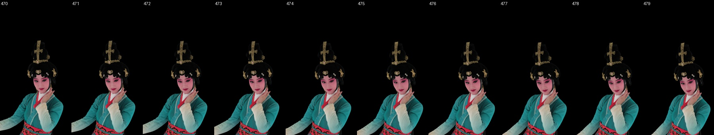

# Luster girl: dataset and training handoff

## What was tested

This report covers static frame 000470 and the unfinished two-second sequence
000470–000529 (30FPS, one real model per frame). The source recipe was
`lookcloser-blur-validated` at `09b5e830`; the experiment branch reached `38c9e520`.
The portable dataset code and new-session task are on **`chinise_girl`**.

### Data and preprocessing

Access the source with SSH/rsync through `ubuntu@dev3`:

- RGB and per-frame calibration: `/fsx/tmp/luster/root_8s/working/fullres/<frame>/`;
  `images/*.jpg`, `sparse/text/{cameras.txt,images.txt}`. These are already undistorted.
- SAM3: `/fsx/tmp/luster/masks_sam3final_8s/cam_N/<frame>.png` (unpadded N).
- Plate fallback: `/fsx/tmp/luster/masks_8s/cam_N/<frame>.png`.
- Background plates: `/fsx/oregon/Luster_data/background/cam_NNN.png`.
- Bounds: `/fsx/tmp/luster/root_8s/bounds_8s.json`;
  source notes: `/fsx/oregon/Luster_data/readme.txt`.
- Historical archive: `/fsx/tmp/luster/lookcloser_video_000470_000529_20260930`.
  It contains frame artifacts/checkpoints under `artifacts/frames` and campaign
  metadata under `artifacts/campaign`. Archive completeness must be checked on
  dev3; local frequency completion alone does not prove remote archive coverage.

All 165 cameras are kept: 162 train; eval012/095/150. Native train review uses
011/097/151. Resize the long side to1920 with area resampling, without cropping:
96 portrait1406×1920, 69 landscape1920×1406. Scale each intrinsic axis by its
actual rounded dimension ratio. Video renders are1080×1920.

Composite subject RGB onto black using mask coverage before downsampling. Keep
originals for boundary review. Cam164 has an incorrectly sized SAM mask; use the
full-size plate mask and exclude it from background-density supervision. Detect
other dimension mismatches rather than stretching masks: cam016 needed the same
fallback on480–491. Empty close-view masks can be legitimate.

For cam020/036 remove only disconnected components touching source x<680, while
preserving the dominant subject component. A fixed strip cut would remove the
moving hand. A manually reviewed, source-hash-bound polygon removes studio
background in cam011/frame475. It changes only that train target and requires a
new frequency fit; it is not a general segmentation algorithm. The fresh runner
applies the same reviewed polygon before training475; this differs from the
historical475 model, where the correction was evaluated after training.

Normalize coordinates from train camera poses (up/focus, scale .22603765 in the
historical sequence). Derive a256³ train-silhouette hull with98% agreement, at
least10 witnesses, dominant connected component, and5% padding. Freeze one
normalization and the union AABB across the requested sequence. For470–529 it was
`[-.25330705,-.23799252,-.59801302]` to `[.23497932,.22093071,.29345155]`.
Do not reuse the static tight AABB for moving arms. Audit source SHA256,
calibration, foreground-ray coverage and train-only frequency maps before fitting.

### Hyperparameters and stage decisions

Seed42;4096 rays; hash23; max resolution8192; mixed precision; safe exponential
plus corrected SH; density normalization `none`; no depth supervision. Keep the
4096-step fixed256-sample warmup and stable occupancy. Training adaptive coarse
step .001; final export .0005, cap4096. FR .3 is a modest tie-break winner here,
not an established universal improvement. Frequency maps:162 train views,
1000 steps per level; no eval maps.

Trusted-background optical thickness weight .02;3px unknown boundary margin;
exclude plate-fallback cameras. The penalty uses sum(sigma×delta), retaining a
gradient when rendered opacity saturates. The final render additionally intersects
occupancy with a conservative train hull (3 hull voxels plus half an occupancy
cell diagonal). Keep raw renders: the guard changes rendering, not field weights,
and must be checked for clipping.

Cold sequence seed: LR .01, review8000/16000, FR .3 from16000, review24000,
then LR base .002 and review28000/32000. Historically28000 was selected. Temporal
frames receive only the previous accepted field parameters; optimizer, scheduler,
scaler, RNG, occupancy, frequency state and counters reset. Same-frame extensions
resume full state. LR .002 toward .0001 over200000 steps; first6000 (eval4096/6000),
then2000-step checks. Continue while PSNR gains≥.07dB or LPIPS drops≥.001; otherwise
inspect/export. One bounded4000-step polish at half LR is permitted; normal
budget24000. No blind frequency tuning while train faces remain blurry.

Select by highest all-eval PSNR, with lower LPIPS breaking ties within .07dB.
Final numeric screen: PSNR≥30, SSIM≥.947, LPIPS≤.060, mean foreground PSNR≥24.
Visual review remains mandatory; exceptions require a reason and checkpoint hash.
These are dataset screens, not guarantees of sharpness. Do not lower them merely
to complete the sequence. Check controller, workers, progress and OOM at least
hourly, and inspect native train/eval crops at each required gate.

## Results

Static40000: raw **31.026 / .9613 / .04042**; fine guarded export
**31.085 / .9630 / .03809** (PSNR/SSIM/LPIPS). Corrected sampling made the paired
activation test meaningful: at20000 control30.089 versus exponential+SH30.248dB.

Fourteen video models470–483 were accepted. Final guarded scores range from
28.944 to30.659dB, SSIM .94474–.96205, LPIPS .03690–.06358.
[Per-frame values and checkpoint hashes](assets/luster_handoff/accepted_metrics.json).
Frames482/483 failed all three whole-image thresholds and were accepted only as
reviewed visual compromises; do not describe their numeric gates as passed.
Frame484 selected16000 after18000 worsened all three raw metrics:
**28.38738 / .936019 / .088244**. Its fine export and acceptance are pending.

The full60-frame video remains unfinished. All60 frequency fits completed by the
2026-10-01 handoff. Historical accepted renders retain soft skin, eyelashes and
fine jewelry; no claim of artifact-free rendering from arbitrary cameras is made.

## Insights and next steps

- Fix sampling identity and map dimensions before interpreting rendering quality.
  The general FAS fix and opt-in safe exponential/SH are promoted to main.
- Canonical AABB density scaling did not transfer reliably to fight; leave it
  and dataset-specific masking/background/guard policies on the research branch.
- Training targets contain segmentation errors. Cam095/frame480 retained studio
  background in an arm–waist gap;2580 diagnostic pixels explain41.84% of that
  view's squared RGB error. Do not edit eval targets to improve scores.
- Adjacent-frame warm starts still needed16–24k steps. Neither lower initial LR
  nor removal of coarse warmup solved the initial pilot blur. Monitor accumulating
  face softness rather than assuming temporal transfer is cheap.
- On the new machine start from original data, run the portable bootstrap on
  `chinise_girl`, and review the fresh seed before propagating its parameters.
  The new orchestration is CPU-tested; GPU/SSH end-to-end validation is still
  required there because this session has no GPU devices or network access.

Detailed histories: [static experiment](luster_000470.md),
[video experiment](luster_video_000470_000529.md). Historical absolute links in
those reports identify archived evidence rather than fresh-machine dependencies.

### Portable implementation validation

The `chinise_girl` entrypoint and task file now live in Git. The recipe no longer
loads the historical static request or forces a previous host's CUDA/cache paths.
Frame470 is ingested from dev3 like every other frame. Source-specific mask
repair is bundled with its reviewed evidence and exact source hashes. The first
6000-step warm-frame stage requires visual review before longer continuation.
The controller resumes the latest completed stage even if older checkpoints
were pruned. Final acceptance binds the model identity and any numeric exception.

CPU validation covers recipe construction, fresh470 preparation dispatch,
new-machine environment settings, immutable campaign inputs, exclusive locking,
checkpoint-bound visual gates, archive verification and retention. A real H.264
fixture encodes two distinct1080×1920 frames at30FPS and verifies decode/ffprobe;
stale acceptance and duplicate learned fields are rejected. GPU training and SSH
are not available in the packaging session, so a fresh end-to-end run remains
required on the destination machine. See `chinise_girl_video_task.md` at repo root.
