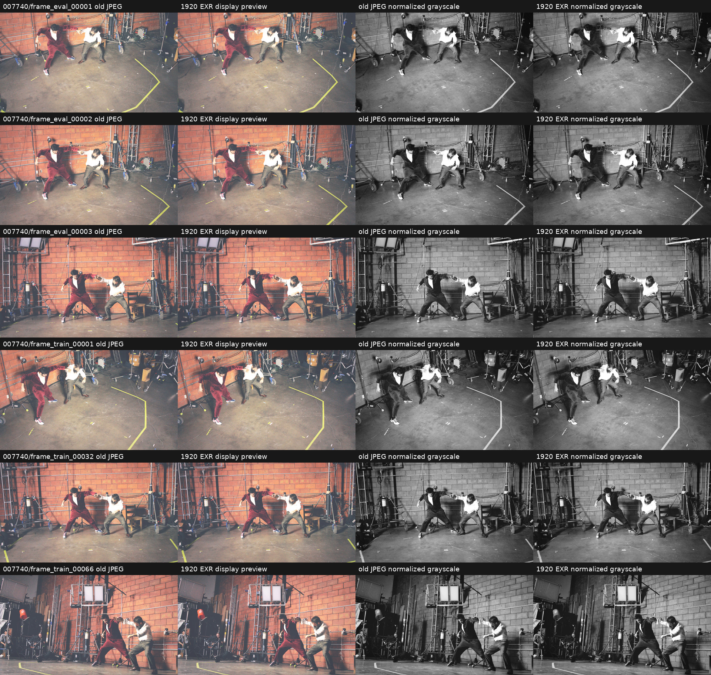
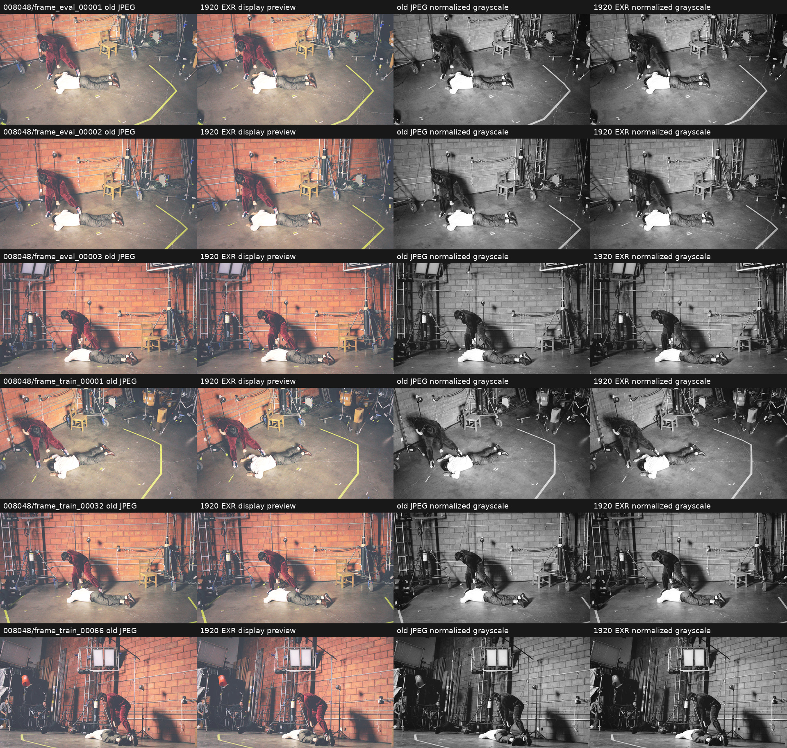

# Cropped 1920×1080 temporal linear-EXR dataset

## What was tested

A second EXR dataset was created at
`/mnt/data/temporal_perframe_stride7_45f_exr_1920x1080` without modifying or removing the existing
full-resolution dataset at `/mnt/data/temporal_perframe_stride7_45f`.

Each full `6144×3072` linear-sRGB EXR was processed with the same spatial pipeline used to create
the historical JPEG dataset:

1. Center crop `(left=341, top=0, right=5802, bottom=3072)`, producing `5461×3072`.
2. Pillow Lanczos resize to `2560×1440`.
3. Pillow Lanczos resize to `1920×1080`.

Resampling is applied directly to linear float pixels. Exposure correction, color correction,
ACES/grade, transfer functions and clamping are not applied. Outputs retain the source sRGB
chromaticities and are stored as RGB half-float OpenEXR with ZIPS compression.

The old JPEG `transforms.json` files are the metadata template. Every camera record, including
intrinsics, camera-to-world matrix, distortion coefficients, camera model and COLMAP image ID, is
copied exactly; only `.jpg` in `file_path` is replaced by `.exr`.

## Results

| Check | Result |
|---|---:|
| Temporal frames | 45 (`007740`–`008048`, stride 7) |
| Train / eval cameras per frame | 66 / 3 |
| EXR files | 3105 |
| JPEG files in new dataset | 0 |
| Dimensions | 1920×1080 |
| EXR layout | RGB, float16, ZIPS |
| Color encoding | linear sRGB |
| Color/exposure correction | none |
| Crop | `[341:5802, 0:3072]`, 5461×3072 |
| Resampling | Lanczos 2560×1440 → Lanczos 1920×1080 |
| Total image bytes | 28,468,645,406 (26.513 GiB) |
| Decoded value range | -0.717285 to 10.0 |
| Full pre-install SHA-256 verification | 3105 / 3105 |
| Post-install header/size verification | 3105 / 3105 |
| Camera records identical to JPEG revision | 3105 / 3105 |
| Raw physical → full EXR → 1920 EXR camera mapping | 3105 / 3105 |
| Stable canonical stem → COLMAP ID mappings | 69 / 69 across all 45 frames |
| Maximum full↔cropped intrinsics round-trip error | 4.55e-13 px |
| Maximum normalized-ray error | 1.11e-16 |
| Image basenames identical | 3105 / 3105 |
| Directory structure identical | 360 / 360 directories |
| Read-only inputs unchanged | yes |

Negative values outside the source black offset can occur from Lanczos ringing around strong HDR
transitions. They are intentionally retained because no value clamp was requested.

Visual inspection covered all eval cameras and train cameras 1, 32 and 66 at the initial, middle and
final temporal frames. The old JPEG and new EXR preview have matching crop boundaries, composition,
camera identity and temporal state. Their display brightness differs slightly because the JPEG
contains the historical grade while the EXR data does not. Normalized grayscale pairs were also
inspected to isolate spatial correspondence from the display transform.

A follow-up feature audit tested 18 old-JPEG/new-EXR pairs: the first, middle and final temporal
frames, with all three eval cameras and train cameras 1, 32 and 66. Brightness-normalized ORB
features were fitted with a RANSAC partial affine transform. Every pair had at least 4965 inliers;
the maximum fitted translation was 0.0087 px, maximum absolute scale error was 6.1e-6, maximum
rotation was 0.00045 degrees, and maximum median inlier residual was 0.0044 px. These subpixel
residuals are effectively zero at feature-detector precision and independently rule out a crop or
resize offset.

### Visual comparisons

Columns show the old JPEG, a temporary display preview of the new linear EXR, normalized JPEG
grayscale and normalized EXR-preview grayscale. The preview transform is not written to the EXR.

## Insights

This revision is the geometry-compatible EXR counterpart of the historical `1920×1080` JPEG
dataset. Existing COLMAP camera data can be reused directly and does not require either a COLMAP
rerun or an intrinsics conversion. The full-resolution EXR revision remains available separately
when the wider native field of view is desired.

One inherited metadata issue is separate from camera validity: every `transforms.json` names
`sparse_pc.ply`, but that file is absent from the protected JPEG dataset, its `/mnt/data` backup,
and both EXR revisions. The EXR conversion neither introduced nor worsened this condition. Camera
training is unaffected with Nerfstudio's default `load_3D_points=False`; a workflow that explicitly
requests sparse-point initialization must first restore or regenerate the point cloud. Thus camera
poses/intrinsics/distortion/COLMAP IDs are fully reusable, while a sparse COLMAP point cloud is not
currently present to reuse.

The current PIL-based Nerfstudio loader still requires float-EXR support before this dataset can be
used directly for training. Existing frequency maps describe JPEG pixels and must be regenerated
from this linear EXR revision.

The conversion is reproducible with `scripts/create_temporal_exr_1920x1080.py`; visual sheets are
generated by `scripts/audit_temporal_raw_exr_visuals.py`. Dataset-side provenance is stored in
`exr_1920x1080_conversion_manifest.json`,
`dataset_content_manifest_exr_1920x1080_20260807.json`, and
`exr_1920x1080_install_manifest.json`.
