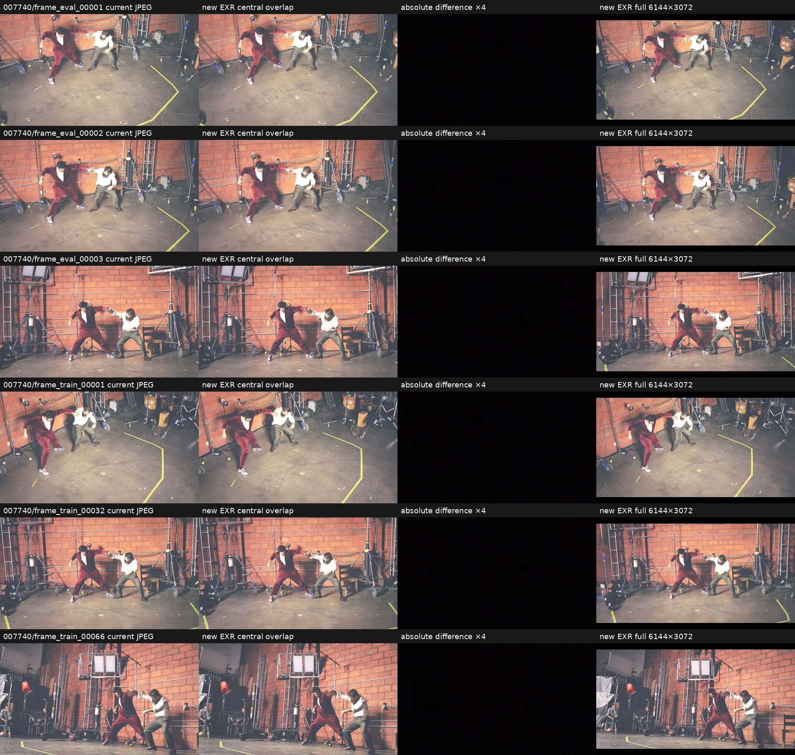
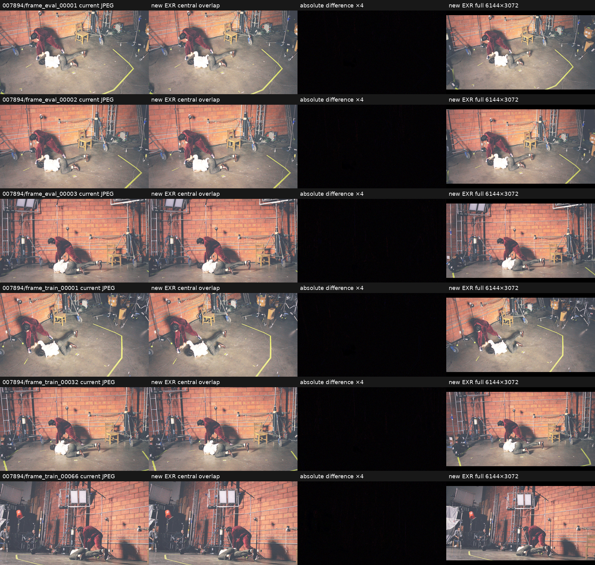
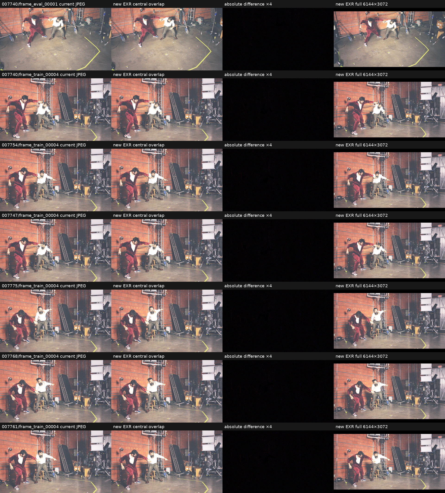

# Full-resolution temporal raw-EXR dataset rebuild

## What was tested

The 45-frame temporal dataset at `/mnt/data/temporal_perframe_stride7_45f` was rebuilt from the
matching raw files in `/mnt/data/6A_4_EXR/<frame>`. The protected source dataset at
`/home/brans/temporal_perframe_stride7_45f` was read for validation only and was never used as a
write target.

The rebuild preserves the original frame selection (`007740` through `008048`, stride 7), the 66
train cameras, the 3 eval cameras, filenames, camera-to-world matrices, distortion coefficients,
and COLMAP image IDs. The eval mapping remains:

| Dataset filename | Physical source camera |
|---|---|
| `frame_eval_00001.exr` | `D004_A014.exr` |
| `frame_eval_00002.exr` | `E004_B014.exr` |
| `frame_eval_00003.exr` | `I004_D014.exr` |

Every output EXR is copied byte-for-byte from its physical-camera source. No exposure correction,
color correction, display transform, clamp, or resampling is applied. The files are labelled
linear sRGB, retain their source half-float HDR values, and already have the required native
`6144×3072` dimensions. The historical grade is used only in disposable visual previews that
compare the central overlap against the old JPEG dataset.

The old `1920×1080` images represented a centered crop from the native 2:1 frame. Intrinsics were
lifted back to full-frame pixel coordinates with `crop_left=341`, `crop_width=5461`,
`sx=5461/1920`, and `sy=3072/1080`. Extrinsics and COLMAP identities were not changed.

## Results

| Check | Result |
|---|---:|
| Temporal frames | 45 |
| Train / eval cameras per frame | 66 / 3 |
| Installed EXR images | 3105 |
| Remaining JPEG images in active dataset | 0 |
| Directory structure vs previous `/mnt/data` copy | identical, 360 / 360 directories |
| Image basename correspondence | identical, 3105 / 3105 (only `.jpg` → `.exr`) |
| Image dimensions | 6144×3072 |
| EXR layout | RGB, float16, ZIPS |
| Color encoding | linear sRGB |
| Color/exposure correction | none |
| Source-byte-exact SHA-256 matches | 3105 / 3105 |
| Total EXR bytes | 232,662,213,932 (216.684 GiB) |
| Dataset-wide decoded value range | -0.0064163 to 15.6171875 |
| Maximum normalized-ray error after intrinsics conversion | 1.11e-16 |
| Preview-vs-JPEG PSNR, min / mean | 36.064 / 36.594 dB |
| Preview-vs-JPEG MAE, max / mean | 2.949 / 2.808 levels |
| COLMAP invariant aggregate | `1f5b5e1bafa380506f2e3dc02c7b6db1a626c6eab5ce3769f81fd296120dae97` |
| Protected dataset unchanged | yes |

The full pre-install verification hashed every output and corresponding source EXR. The independent
post-install pass checked all 3105 installed headers and payload sizes again, with no errors. The
active dataset is `/mnt/data/temporal_perframe_stride7_45f`. The previous JPEG copy was retained at
`/mnt/data/temporal_perframe_stride7_45f_jpeg_backup_20260807`.

Visual inspection covered all three eval cameras plus train cameras 1, 32, and 66 at the first,
middle, and final temporal frames. A separate sheet covers the six lowest preview-PSNR cases. In
all inspected cases, camera identity and temporal state match the JPEG reference; the central
overlap is aligned and the full EXR adds the expected left/right field of view without stretching.
The small residual in the amplified difference panels is consistent with the historical JPEG
encoding path.

### Visual comparisons

Columns are: old JPEG, display-preview of the EXR central overlap, absolute difference multiplied
by four, and display-preview of the complete 2:1 EXR. Display grading in these sheets is strictly a
viewing aid and is not present in the EXR dataset.

## Insights

The existing COLMAP result is reusable without rerunning reconstruction: camera poses, physical
camera assignment, eval/train split, distortion, and COLMAP IDs are unchanged. Only the image-plane
dimensions and intrinsics are transformed to the native full-frame coordinate system, with
effectively zero normalized-ray discrepancy.

Frequency maps from the `1920×1080` JPEG revision cannot be reused at `6144×3072` and were not
copied into the rebuilt image contract. Also, the current PIL-based Nerfstudio loader does not
decode float EXR. EXR loader support and frequency-map regeneration are follow-up prerequisites for
training, but neither limitation invalidates reuse of the COLMAP cameras.

The reproducible conversion and audit entry points are
`scripts/convert_temporal_raw_exr_dataset.py` and
`scripts/audit_temporal_raw_exr_visuals.py`. Dataset-side manifests are
`exr_conversion_manifest.json`, `dataset_content_manifest_exr_20260807.json`, and
`exr_install_manifest.json` in the active dataset root.
